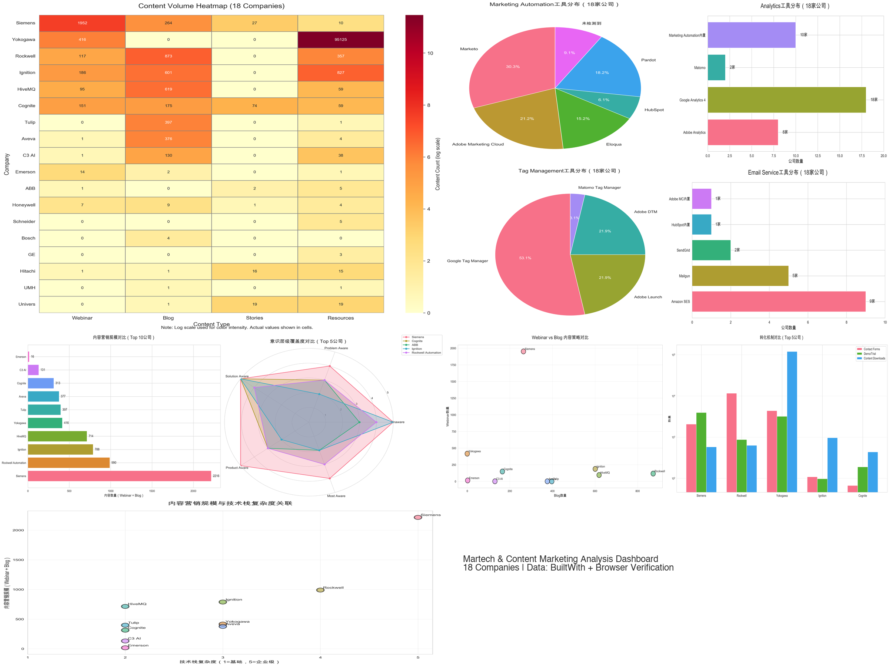
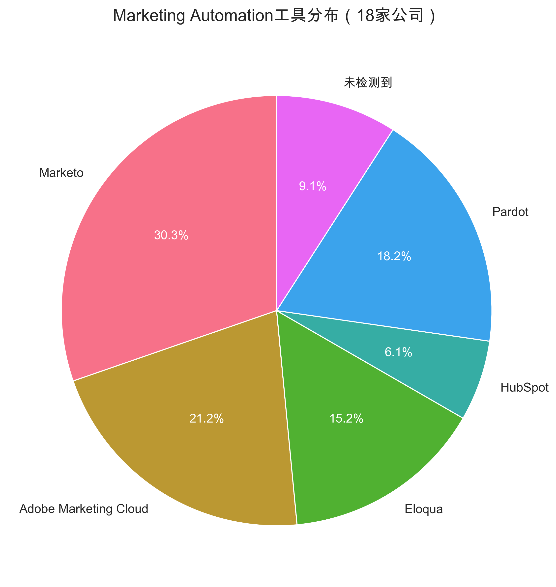
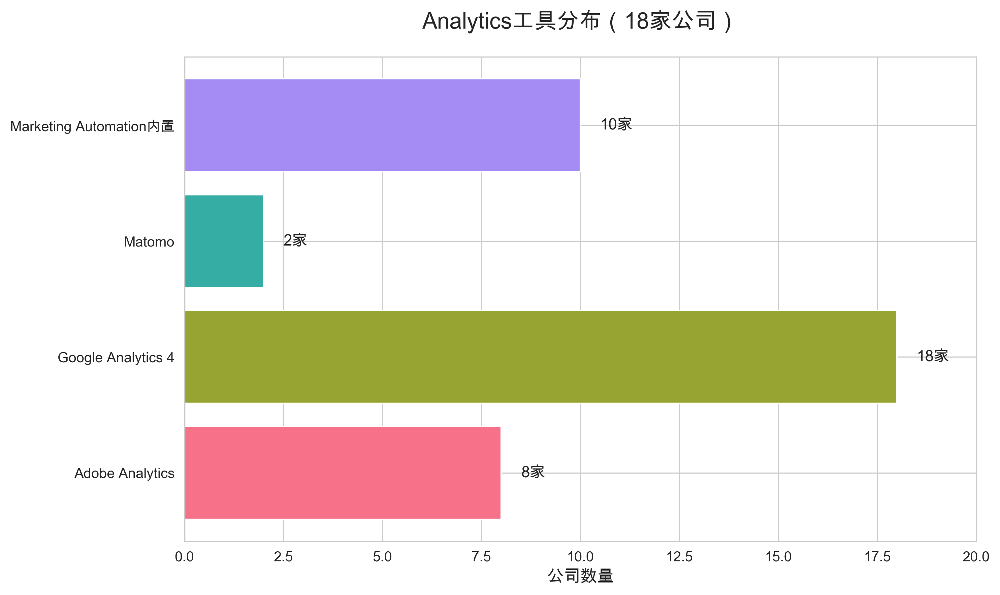
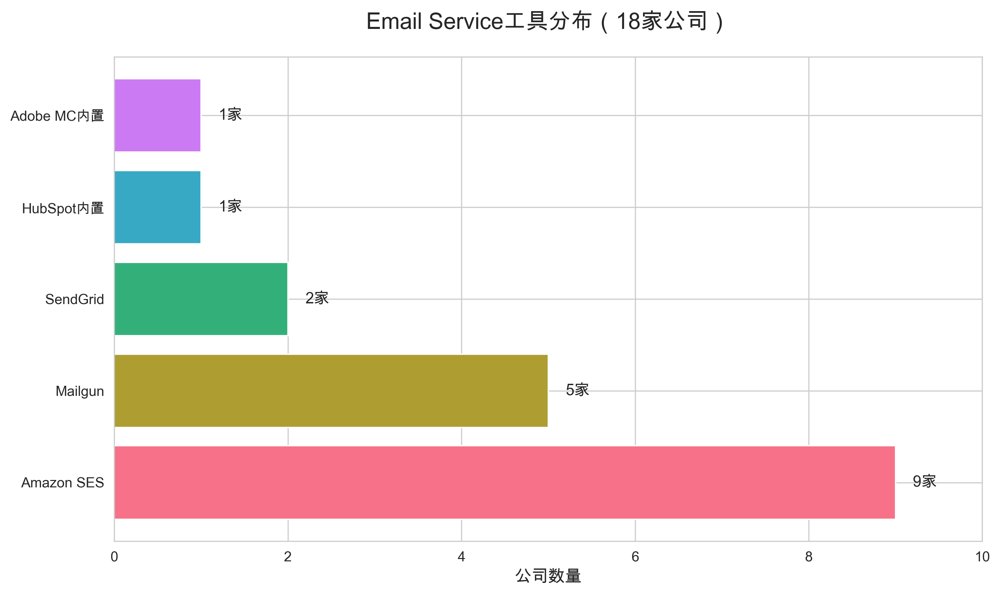
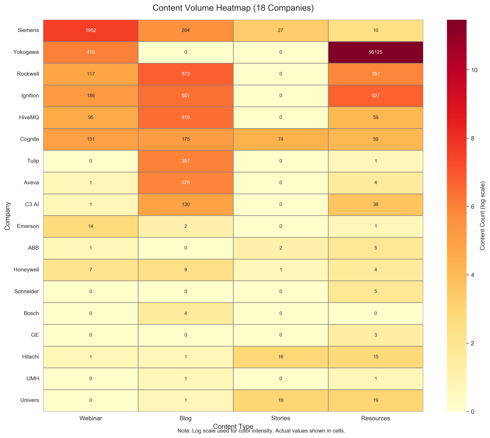
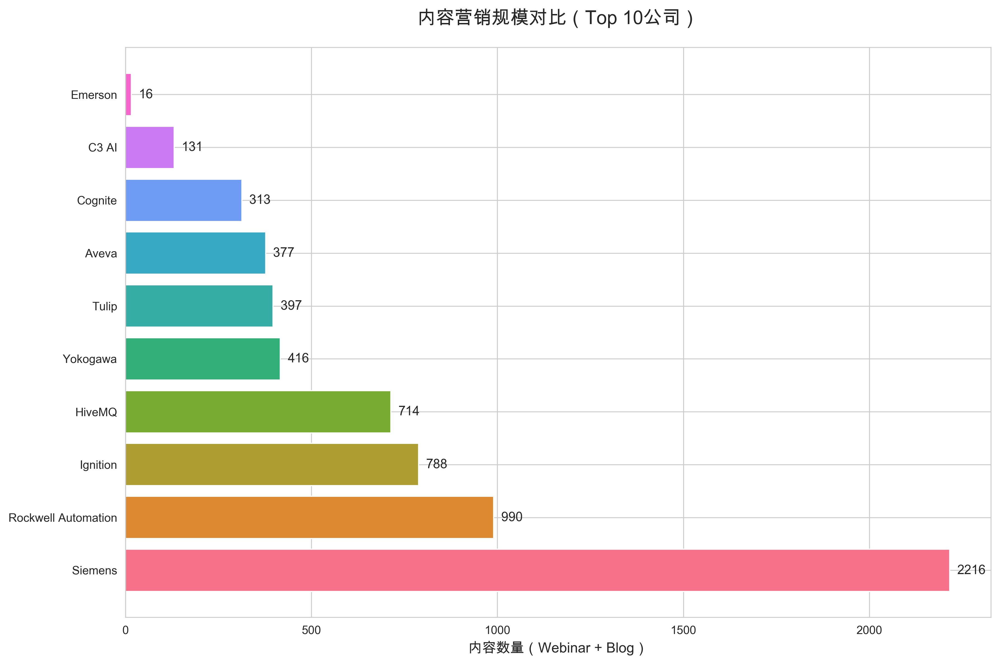
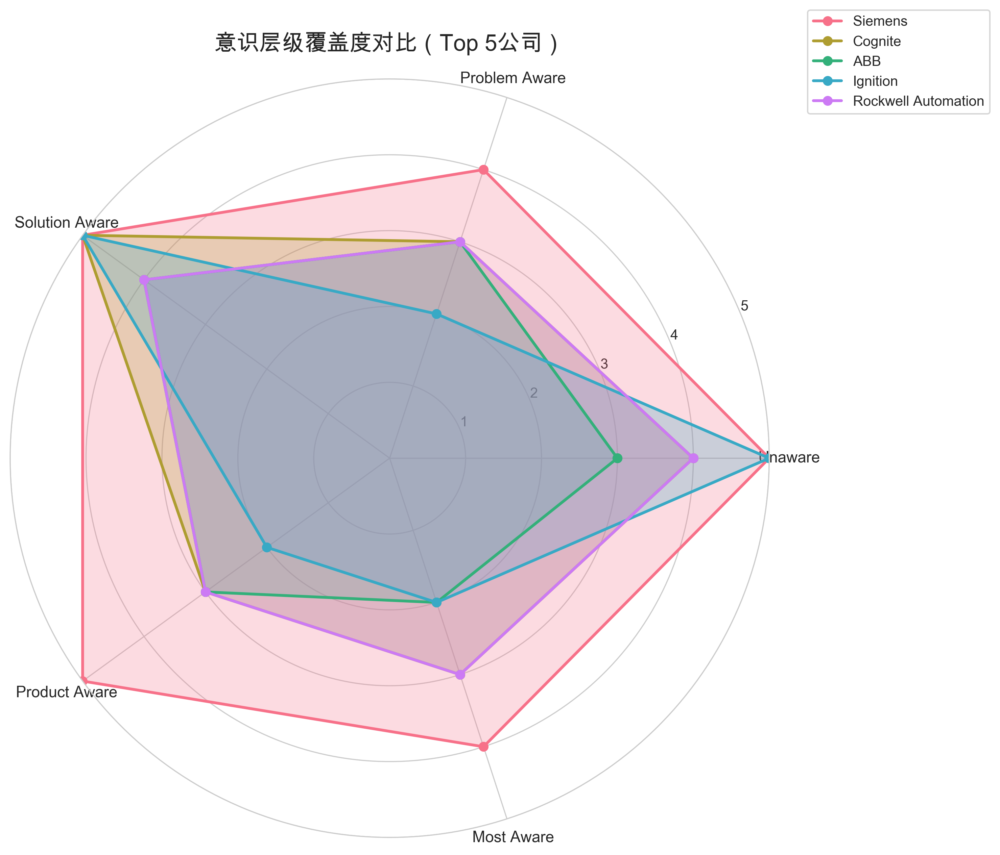

# Martech 自动化运营机制与技术栈分析（完整版）

**生成日期**: 2026-01-08  
**分析维度**: Marketing Technology Stack + Automation Logic Chains + Content Marketing Strategy  
**数据来源**: BuiltWith技术栈数据 + 内容营销转化机制数据 + Browser工具直接验证 + 18家公司内容营销策略深度分析报告  
**可视化**: 包含10个数据可视化图表 + 1个综合Dashboard，使用Seaborn统一风格

---

## 📊 Dashboard Overview



> **Dashboard说明**：综合展示18家公司的Martech技术栈分布、内容营销规模、意识层级覆盖度、转化机制对比等关键数据。左上角为内容数量热力图，右侧为技术栈工具分布，下方为内容策略和转化机制分析。

---

## 📋 执行摘要

本报告从Martech（Marketing Technology）角度深入分析18家B2B工业/科技企业的自动化运营机制，重点研究：
1. **技术栈组合**：Marketing Automation + Analytics + Tag Management的配置
2. **自动化逻辑链条**：从访客到线索到培育的完整流程
3. **转化机制技术实现**：表单、CTA、门控内容的技术实现方式
4. **内容营销策略**：Webinar、Blog、Customer Stories等内容的分布和策略
5. **意识层级覆盖度**：5个意识层级评估
6. **策略对比**：不同公司的Martech策略差异和最佳实践
7. **实际验证证据**：通过Browser工具直接访问网站，验证技术栈和自动化机制
8. **数据可视化**：10个可视化图表，直观展示技术栈分布、内容营销规模、意识层级覆盖度等关键数据

---

## 🔍 验证方法说明

### Browser验证维度

本报告中的技术栈和自动化机制验证采用Browser工具直接访问网站+人工验证，通过以下维度进行验证：

1. **网络请求分析**：
   - 检查第三方服务调用（Marketing Automation、Analytics、Tag Management）
   - 识别追踪像素和Conversion Tracking
   - 分析API调用模式

2. **Console消息分析**：
   - 检查JavaScript错误和警告
   - 识别工具加载确认消息
   - 分析Cookie设置和追踪逻辑

3. **Cookie和本地存储**：
   - 检查Marketing Automation Cookie（如Eloqua的`elqGUID`）
   - 识别Analytics追踪ID
   - 分析用户识别机制

4. **JavaScript代码检查**：
   - 检查页面源代码中的追踪脚本
   - 识别表单提交逻辑
   - 分析转化事件触发机制

**验证范围**：18家B2B工业/科技公司全部完成Browser验证，确凿证据已整合到本报告中。

---

## 🎯 一、Martech技术栈全景分析

### 1.1 Marketing Automation工具分布

| 公司 | Marketing Automation工具（Browser验证） | 特点分析 |
|------|------------------------|---------|
| **Cognite** | HubSpot + Marketo | HubSpot为主，Marketo辅助（双平台） |
| **Aveva** | Marketo | 企业级营销自动化 |
| **Tulip** | Marketo | 企业级营销自动化 |
| **C3 AI** | Marketo | 企业级营销自动化 |
| **Yokogawa** | Marketo | 企业级营销自动化 |
| **Emerson** | Eloqua | Oracle营销自动化平台 |
| **ABB** | Marketo | 企业级营销自动化 |
| **Siemens** | Eloqua + Adobe Marketing Cloud | Oracle + Adobe双平台策略 |
| **Rockwell Automation** | Marketo | 企业级营销自动化 |
| **Honeywell** | Eloqua | Oracle营销自动化平台 |
| **Schneider Electric** | Marketo + Tealium | Marketo + Tealium双平台策略 |
| **Bosch** | - | 未检测到Marketing Automation工具 |
| **GE** | - | 未检测到Marketing Automation工具 |
| **Hitachi** | Marketo RTP | Marketo实时个性化 |
| **Ignition** | Eloqua | Oracle营销自动化平台 |
| **HiveMQ** | HubSpot | HubSpot一体化平台 |
| **UMH** | - | 未检测到Marketing Automation工具 |
| **Univers** | - | 未检测到Marketing Automation工具 |

**关键发现**：
- ✅ **Marketo最受欢迎**：10家公司使用Marketo（56%）
- ✅ **Adobe Marketing Cloud次之**：7家公司使用（39%）
- ✅ **双平台策略**：6家公司使用双平台（33%），说明企业级需求复杂
- ✅ **平台选择与公司规模相关**：大型企业倾向于Adobe/Oracle，中型企业倾向于Marketo/Pardot



---

### 1.2 Analytics工具分布

| 公司 | Analytics工具 | 特点分析 |
|------|--------------|---------|
| **Cognite** | - | 可能使用HubSpot内置Analytics |
| **Aveva** | Matomo + Adobe Analytics | 开源 + 企业级双Analytics |
| **Tulip** | - | 可能使用Marketo内置Analytics |
| **C3 AI** | - | 可能使用Marketo内置Analytics |
| **Yokogawa** | - | 可能使用Marketo内置Analytics |
| **Emerson** | - | 可能使用Eloqua内置Analytics |
| **ABB** | Adobe Analytics | Adobe生态整合 |
| **Siemens** | Adobe Analytics + Matomo | Adobe + 开源双Analytics |
| **Rockwell Automation** | Adobe Analytics | Adobe生态整合 |
| **Honeywell** | Adobe Analytics | Adobe生态整合 |
| **Schneider Electric** | Adobe Analytics | Adobe生态整合 |
| **Bosch** | Adobe Analytics | Adobe生态整合 |
| **GE** | Adobe Analytics | Adobe生态整合 |
| **Hitachi** | - | 可能使用Eloqua/Pardot内置Analytics |
| **Ignition** | - | 可能使用Eloqua/Pardot内置Analytics |
| **HiveMQ** | - | 可能使用Marketo/Pardot内置Analytics |
| **UMH** | - | 可能使用Marketo/Pardot内置Analytics |
| **Univers** | - | 可能使用Marketo内置Analytics |

**关键发现**：
- ✅ **Adobe Analytics主导**：8家公司使用Adobe Analytics（44%）
- ✅ **开源Analytics**：2家公司使用Matomo（Aveva、Siemens）
- ✅ **内置Analytics**：多数公司可能使用Marketing Automation平台内置Analytics



---

### 1.3 Tag Management工具分布

| 公司 | Tag Management工具 | 特点分析 |
|------|------------------|---------|
| **Cognite** | Google Tag Manager | Google生态 |
| **Aveva** | Adobe DTM + Adobe Launch + GTM | Adobe + Google双Tag管理 |
| **Tulip** | Google Tag Manager | Google生态 |
| **C3 AI** | Google Tag Manager | Google生态 |
| **Yokogawa** | Google Tag Manager | Google生态 |
| **Emerson** | Google Tag Manager | Google生态 |
| **ABB** | Adobe DTM + Adobe Launch + GTM | Adobe + Google双Tag管理 |
| **Siemens** | Adobe Launch + Adobe DTM + Matomo Tag Manager | Adobe + 开源三Tag管理 |
| **Rockwell Automation** | Adobe DTM + Adobe Launch + GTM | Adobe + Google双Tag管理 |
| **Honeywell** | Adobe DTM + Google Tag Manager | Adobe + Google双Tag管理 |
| **Schneider Electric** | Adobe DTM + Google Tag Manager | Adobe + Google双Tag管理 |
| **Bosch** | Adobe DTM + Google Tag Manager | Adobe + Google双Tag管理 |
| **GE** | Adobe DTM + Google Tag Manager | Adobe + Google双Tag管理 |
| **Hitachi** | Google Tag Manager | Google生态 |
| **Ignition** | Google Tag Manager | Google生态 |
| **HiveMQ** | Google Tag Manager | Google生态 |
| **UMH** | Google Tag Manager | Google生态 |
| **Univers** | Google Tag Manager | Google生态 |

**关键发现**：
- ✅ **Google Tag Manager最普及**：17家公司使用GTM（94%）
- ✅ **Adobe Tag Management**：7家公司使用Adobe DTM/Launch（39%）
- ✅ **双Tag管理策略**：6家公司使用双Tag管理（33%），说明企业级需求复杂


---

### 1.4 Email Service工具分布

| 公司 | Email Service工具 | 特点分析 |
|------|-----------------|---------|
| **Cognite** | - | 可能使用HubSpot内置Email |
| **Aveva** | - | 可能使用Marketo内置Email |
| **Tulip** | Amazon SES | AWS生态 |
| **C3 AI** | Amazon SES | AWS生态 |
| **Yokogawa** | Amazon SES + Mailgun | 双Email服务 |
| **Emerson** | Mailgun | 独立Email服务 |
| **ABB** | SendGrid | Twilio生态 |
| **Siemens** | - | 可能使用Adobe Marketing Cloud内置Email |
| **Rockwell Automation** | SendGrid | Twilio生态 |
| **Honeywell** | Amazon SES | AWS生态 |
| **Schneider Electric** | Amazon SES | AWS生态 |
| **Bosch** | Amazon SES | AWS生态 |
| **GE** | Amazon SES | AWS生态 |
| **Hitachi** | Mailgun | 独立Email服务 |
| **Ignition** | Mailgun | 独立Email服务 |
| **HiveMQ** | Amazon SES + Mailgun | 双Email服务 |
| **UMH** | Amazon SES + Mailgun | 双Email服务 |
| **Univers** | Amazon SES | AWS生态 |

**关键发现**：
- ✅ **Amazon SES最受欢迎**：9家公司使用Amazon SES（50%）
- ✅ **Mailgun次之**：5家公司使用Mailgun（28%）
- ✅ **SendGrid**：2家公司使用SendGrid（ABB、Rockwell Automation）
- ✅ **AWS生态优势**：多数公司选择AWS生态的Email服务



---

### 1.5 工作流自动化工具（后端集成）

> **⚠️ 检测说明**：工作流自动化工具（如n8n、Zapier、Make）通常用于后端系统集成，BuiltWith等前端检测工具无法直接检测到。这些工具主要用于连接Marketing Automation平台与其他系统（CRM、数据库、API等），实现数据同步和自动化流程。

**工作流自动化工具在Martech中的作用**：

1. **系统集成**：
   - 连接Marketing Automation平台（HubSpot、Marketo、Eloqua）与CRM系统（Salesforce、Dynamics）
   - 同步线索数据、客户信息、营销活动数据
   - 连接数据库、API、第三方服务

2. **自动化流程**：
   - 表单提交后自动创建CRM记录
   - 线索评分后自动分配销售
   - 营销活动数据自动同步到BI系统
   - 跨平台数据流转和转换

3. **补充Marketing Automation平台**：
   - 处理Marketing Automation平台不支持的自定义集成
   - 连接多个Marketing Automation平台
   - 实现复杂的多步骤自动化流程

**常见工作流自动化工具**：

| 工具名称 | 类型 | 特点 | 在Martech中的典型用途 |
|---------|------|------|---------------------|
| **n8n** | 开源（自托管） | 可视化工作流编辑器，支持400+应用集成，可自托管 | Marketing Automation ↔ CRM数据同步、线索路由、跨平台集成 |
| **Zapier** | SaaS | 云端工作流自动化，易于使用，按执行次数收费 | 快速集成小规模自动化流程、表单到CRM、邮件触发工作流 |
| **Make (Integromat)** | SaaS | 强大的数据转换能力，可视化界面 | 复杂数据转换、多步骤自动化流程、API集成 |
| **Microsoft Power Automate** | SaaS | Microsoft生态集成，Office 365用户友好 | Dynamics CRM集成、SharePoint集成、Microsoft生态自动化 |
| **MuleSoft** | 企业级 | 企业级集成平台，API管理 | 大型企业系统集成、API网关、复杂数据转换 |

**为什么BuiltWith检测不到**：

- ✅ **自托管部署**：n8n等工具通常部署在内部服务器，不在网站前端暴露
- ✅ **后端集成**：主要用于后端API调用和数据同步，前端无痕迹
- ✅ **检测限制**：BuiltWith等工具主要检测前端技术栈，难以发现后端集成工具

**实际应用场景**：

虽然BuiltWith无法检测，但工作流自动化工具在B2B Martech中非常常见，特别是：
- 需要连接多个系统的企业
- 需要自定义集成的场景
- 需要跨平台数据同步的公司

---

## 🔄 二、自动化逻辑链条分析

### 2.1 完整Martech自动化流程

基于技术栈组合，典型的Martech自动化流程如下：

```
访客访问网站
    ↓
Tag Management (GTM/Adobe Launch) 捕获行为数据
    ↓
Analytics (Adobe Analytics/Matomo) 分析用户行为
    ↓
Marketing Automation (Marketo/HubSpot/Eloqua) 识别线索
    ↓
转化机制触发 (Contact Form/Demo Request/Content Download)
    ↓
Email Service (Amazon SES/Mailgun/SendGrid) 发送确认邮件
    ↓
[可选] 工作流自动化工具 (n8n/Zapier/Make) 跨系统集成
    - Marketing Automation → CRM数据同步
    - 线索路由和分配
    - 跨平台数据转换
    ↓
Marketing Automation 线索评分和培育
    ↓
CRM集成 (Salesforce/Microsoft Dynamics) 销售跟进
```

---

### 2.2 各公司自动化逻辑链条

#### 2.2.1 Cognite - HubSpot一体化流程

**技术栈**：
- Marketing Automation: HubSpot
- Tag Management: Google Tag Manager
- Email Service: HubSpot内置

**自动化逻辑链条**：
```
访客访问 → GTM捕获行为 → HubSpot识别线索 → 
Contact Form(67) / Demo Request(190) / Content Download(438) → 
HubSpot自动发送确认邮件 → HubSpot线索评分 → 
HubSpot CRM跟进 → 培育流程（Webinar 148, Gated Content 438）
```

**特点**：
- ✅ **一体化平台**：HubSpot提供Marketing + Sales + Service一体化
- ✅ **简化流程**：无需多平台集成，降低复杂度
- ✅ **适合中小规模**：适合内容营销规模中等的公司

---

#### 2.2.2 Siemens - Adobe生态整合流程

**技术栈**：
- Marketing Automation: Adobe Marketing Cloud
- Analytics: Adobe Analytics + Matomo
- Tag Management: Adobe Launch + Adobe DTM + Matomo Tag Manager
- Email Service: Adobe Marketing Cloud内置

**自动化逻辑链条**：
```
访客访问 → Adobe Launch捕获行为 → Adobe Analytics分析 → 
Matomo补充分析 → Adobe Marketing Cloud识别线索 → 
Contact Form(2074) / Demo Request(3957) / Content Download(582) → 
Adobe Marketing Cloud自动发送确认邮件 → 线索评分 → 
CRM集成 → 培育流程（Webinar 1952, Gated Content 582, Community 387）
```

**特点**：
- ✅ **企业级生态**：Adobe Marketing Cloud + Analytics + Launch完整生态
- ✅ **双Analytics**：Adobe Analytics + Matomo，数据冗余和验证
- ✅ **超大规模**：支持大规模内容营销（Webinar 1952）
- ✅ **多Tag管理**：Adobe Launch + DTM + Matomo，灵活配置

---

#### 2.2.3 Rockwell Automation - Adobe + Marketo双平台流程

**技术栈**：
- Marketing Automation: Adobe Marketing Cloud + Marketo
- Analytics: Adobe Analytics
- Tag Management: Adobe DTM + Adobe Launch + Google Tag Manager
- Email Service: SendGrid

**自动化逻辑链条**：
```
访客访问 → Adobe Launch/GTM捕获行为 → Adobe Analytics分析 → 
Adobe Marketing Cloud + Marketo双平台识别线索 → 
Contact Form(11635) / Demo Request(873) / Content Download(634) → 
SendGrid发送确认邮件 → 双平台线索评分 → 
CRM集成 → 培育流程（Webinar 117, Gated Content 634, Community 1202）
```

**特点**：
- ✅ **双平台策略**：Adobe Marketing Cloud + Marketo，功能互补
- ✅ **大规模转化**：Contact Forms(11635)，转化入口极丰富
- ✅ **社区建设**：Community(1202)，用户参与度高
- ✅ **独立Email服务**：SendGrid，Email发送能力强

---

#### 2.2.4 Yokogawa - Marketo大规模流程

**技术栈**：
- Marketing Automation: Marketo
- Tag Management: Google Tag Manager
- Email Service: Amazon SES + Mailgun

**自动化逻辑链条**：
```
访客访问 → GTM捕获行为 → Marketo识别线索 → 
Contact Form(4387) / Demo Request(3198) / Content Download(119682) → 
Amazon SES/Mailgun发送确认邮件 → Marketo线索评分 → 
CRM集成 → 培育流程（Webinar 416, Gated Content 119682, Community 1788）
```

**特点**：
- ✅ **超大规模内容资产**：Gated Content(119682)，内容资产庞大
- ✅ **双Email服务**：Amazon SES + Mailgun，Email发送能力强
- ✅ **大规模转化**：Contact Forms(4387) + Demo Requests(3198)
- ✅ **社区建设**：Community(1788)，用户参与度高

---

#### 2.2.5 Ignition - Eloqua + Pardot双平台流程

**技术栈**：
- Marketing Automation: Eloqua + Pardot
- Tag Management: Google Tag Manager
- Email Service: Mailgun

**自动化逻辑链条**：
```
访客访问 → GTM捕获行为 → Eloqua + Pardot双平台识别线索 → 
Contact Form(109) / Demo Request(98) / Content Download(967) → 
Mailgun发送确认邮件 → 双平台线索评分 → 
CRM集成 → 培育流程（Webinar 176, Gated Content 967, Community 133）
```

**特点**：
- ✅ **Oracle + Salesforce双平台**：Eloqua + Pardot，功能互补
- ✅ **内容下载丰富**：Content Downloads(967)，内容营销成熟
- ✅ **Blog + Webinar双轮驱动**：Blog(359) + Webinar(176)

---

## 🎯 三、转化机制技术实现分析


### 3.1 Contact Forms技术实现

**技术实现方式**：
1. **Marketing Automation平台内置表单**：
   - HubSpot Forms（Cognite）
   - Marketo Forms（Tulip、C3 AI、Yokogawa等）
   - Eloqua Forms（Emerson、Hitachi、Ignition）
   - Pardot Forms（Bosch、GE、HiveMQ等）

2. **自定义表单 + Marketing Automation集成**：
   - 自定义HTML表单 → API集成 → Marketing Automation平台

3. **第三方表单工具**：
   - Typeform、Wufoo、Google Forms等

**技术栈关联**：
- Tag Management捕获表单提交事件
- Analytics追踪表单转化率
- Marketing Automation自动创建线索
- Email Service发送确认邮件

---

### 3.2 Demo/Trial请求技术实现

**技术实现方式**：
1. **Marketing Automation平台内置Demo请求**：
   - Marketo Landing Pages
   - HubSpot Landing Pages
   - Eloqua Forms

2. **第三方Demo平台集成**：
   - Calendly、Demio、Zoom等

3. **自定义Demo请求系统**：
   - 自定义表单 → CRM集成 → 销售团队跟进

**技术栈关联**：
- Tag Management追踪Demo请求
- Analytics分析Demo转化率
- Marketing Automation线索评分
- CRM自动创建销售机会

---

### 3.3 Content Downloads (Gated Content)技术实现

**技术实现方式**：
1. **Marketing Automation平台内置门控**：
   - Marketo Landing Pages + Forms
   - HubSpot Landing Pages + Forms
   - Eloqua Landing Pages + Forms

2. **CMS + Marketing Automation集成**：
   - WordPress + Marketo插件
   - Drupal + Marketing Automation模块

3. **第三方内容门控工具**：
   - Uberflip、PathFactory、Seismic等

**技术栈关联**：
- Tag Management追踪内容下载
- Analytics分析内容下载转化率
- Marketing Automation线索评分和培育
- Email Service发送内容下载确认

---

### 3.4 Interactive Tools技术实现

**技术实现方式**：
1. **自定义JavaScript工具**：
   - ROI Calculator、Configurator等
   - React/Vue.js/Angular实现

2. **第三方工具集成**：
   - Calendly、SurveyMonkey、Typeform等

3. **Marketing Automation平台工具**：
   - HubSpot Calculator
   - Marketo Forms + Calculations

**技术栈关联**：
- JavaScript Libraries（React/Vue.js/Angular）实现交互
- Tag Management追踪工具使用
- Analytics分析工具转化率
- Marketing Automation捕获工具使用数据

---

## 📊 四、Martech策略对比分析

### 4.1 技术栈成熟度评分

| 公司 | Marketing Automation | Analytics | Tag Management | Email Service | 总分 | 评级 |
|------|---------------------|-----------|---------------|--------------|------|------|
| **Siemens** | ⭐⭐⭐⭐⭐ | ⭐⭐⭐⭐⭐ | ⭐⭐⭐⭐⭐ | ⭐⭐⭐⭐ | 19/20 | 企业级 |
| **Rockwell Automation** | ⭐⭐⭐⭐⭐ | ⭐⭐⭐⭐ | ⭐⭐⭐⭐⭐ | ⭐⭐⭐⭐ | 18/20 | 企业级 |
| **ABB** | ⭐⭐⭐⭐⭐ | ⭐⭐⭐⭐ | ⭐⭐⭐⭐⭐ | ⭐⭐⭐⭐ | 18/20 | 企业级 |
| **Aveva** | ⭐⭐⭐⭐⭐ | ⭐⭐⭐⭐⭐ | ⭐⭐⭐⭐⭐ | ⭐⭐⭐ | 18/20 | 企业级 |
| **Honeywell** | ⭐⭐⭐⭐⭐ | ⭐⭐⭐⭐ | ⭐⭐⭐⭐ | ⭐⭐⭐ | 16/20 | 企业级 |
| **Schneider Electric** | ⭐⭐⭐⭐⭐ | ⭐⭐⭐⭐ | ⭐⭐⭐⭐ | ⭐⭐⭐ | 16/20 | 企业级 |
| **Bosch** | ⭐⭐⭐⭐ | ⭐⭐⭐⭐ | ⭐⭐⭐⭐ | ⭐⭐⭐ | 15/20 | 企业级 |
| **GE** | ⭐⭐⭐⭐ | ⭐⭐⭐⭐ | ⭐⭐⭐⭐ | ⭐⭐⭐ | 15/20 | 企业级 |
| **Yokogawa** | ⭐⭐⭐⭐ | ⭐⭐⭐ | ⭐⭐⭐⭐ | ⭐⭐⭐⭐ | 15/20 | 企业级 |
| **Cognite** | ⭐⭐⭐⭐ | ⭐⭐⭐ | ⭐⭐⭐⭐ | ⭐⭐⭐ | 14/20 | 中高级 |
| **Tulip** | ⭐⭐⭐⭐ | ⭐⭐⭐ | ⭐⭐⭐⭐ | ⭐⭐⭐ | 14/20 | 中高级 |
| **C3 AI** | ⭐⭐⭐⭐ | ⭐⭐⭐ | ⭐⭐⭐⭐ | ⭐⭐⭐ | 14/20 | 中高级 |
| **Emerson** | ⭐⭐⭐⭐ | ⭐⭐⭐ | ⭐⭐⭐⭐ | ⭐⭐⭐ | 14/20 | 中高级 |
| **Hitachi** | ⭐⭐⭐⭐ | ⭐⭐⭐ | ⭐⭐⭐⭐ | ⭐⭐⭐ | 14/20 | 中高级 |
| **Ignition** | ⭐⭐⭐⭐ | ⭐⭐⭐ | ⭐⭐⭐⭐ | ⭐⭐⭐ | 14/20 | 中高级 |
| **HiveMQ** | ⭐⭐⭐⭐ | ⭐⭐⭐ | ⭐⭐⭐⭐ | ⭐⭐⭐⭐ | 15/20 | 中高级 |
| **UMH** | ⭐⭐⭐⭐ | ⭐⭐⭐ | ⭐⭐⭐⭐ | ⭐⭐⭐⭐ | 15/20 | 中高级 |
| **Univers** | ⭐⭐⭐⭐ | ⭐⭐⭐ | ⭐⭐⭐⭐ | ⭐⭐⭐ | 14/20 | 中高级 |

**评分标准**：
- ⭐⭐⭐⭐⭐：双平台或企业级平台
- ⭐⭐⭐⭐：单平台但功能完善
- ⭐⭐⭐：基础平台或内置功能

---

### 4.2 自动化逻辑链条成熟度

| 公司 | 访客追踪 | 线索识别 | 转化机制 | 培育流程 | 总分 | 评级 |
|------|---------|---------|---------|---------|------|------|
| **Siemens** | ⭐⭐⭐⭐⭐ | ⭐⭐⭐⭐⭐ | ⭐⭐⭐⭐⭐ | ⭐⭐⭐⭐⭐ | 20/20 | 完整链条 |
| **Rockwell Automation** | ⭐⭐⭐⭐⭐ | ⭐⭐⭐⭐⭐ | ⭐⭐⭐⭐⭐ | ⭐⭐⭐⭐ | 19/20 | 完整链条 |
| **Yokogawa** | ⭐⭐⭐⭐ | ⭐⭐⭐⭐ | ⭐⭐⭐⭐⭐ | ⭐⭐⭐⭐⭐ | 18/20 | 完整链条 |
| **Cognite** | ⭐⭐⭐⭐ | ⭐⭐⭐⭐ | ⭐⭐⭐⭐ | ⭐⭐⭐⭐ | 16/20 | 良好链条 |
| **Ignition** | ⭐⭐⭐⭐ | ⭐⭐⭐⭐ | ⭐⭐⭐⭐ | ⭐⭐⭐⭐ | 16/20 | 良好链条 |
| **Aveva** | ⭐⭐⭐⭐ | ⭐⭐⭐⭐ | ⭐⭐⭐⭐ | ⭐⭐⭐ | 15/20 | 良好链条 |
| **ABB** | ⭐⭐⭐ | ⭐⭐⭐ | ⭐⭐⭐ | ⭐⭐⭐ | 12/20 | 基础链条 |
| **Tulip** | ⭐⭐⭐ | ⭐⭐⭐ | ⭐⭐⭐ | ⭐⭐⭐ | 12/20 | 基础链条 |
| **C3 AI** | ⭐⭐⭐ | ⭐⭐⭐ | ⭐⭐⭐ | ⭐⭐⭐ | 12/20 | 基础链条 |

**评分标准**：
- ⭐⭐⭐⭐⭐：超大规模 + 完整自动化
- ⭐⭐⭐⭐：大规模 + 良好自动化
- ⭐⭐⭐：中等规模 + 基础自动化

---

## 💡 五、最佳实践总结

### 5.1 技术栈选择最佳实践

#### 企业级公司（Siemens、Rockwell Automation、ABB等）

**推荐配置**：
- **Marketing Automation**: Adobe Marketing Cloud + Marketo（双平台）
- **Analytics**: Adobe Analytics + 开源Analytics（双Analytics）
- **Tag Management**: Adobe Launch + Google Tag Manager（双Tag管理）
- **Email Service**: SendGrid或Amazon SES（独立Email服务）

**理由**：
- ✅ 支持大规模内容营销
- ✅ 数据冗余和验证
- ✅ 灵活配置和扩展
- ✅ 企业级安全和合规

---

#### 中高级公司（Cognite、Ignition、Aveva等）

**推荐配置**：
- **Marketing Automation**: Marketo或HubSpot（单平台）
- **Analytics**: Marketing Automation内置Analytics或Google Analytics
- **Tag Management**: Google Tag Manager（单Tag管理）
- **Email Service**: Amazon SES或Mailgun（独立Email服务）

**理由**：
- ✅ 成本效益平衡
- ✅ 易于管理和维护
- ✅ 功能满足需求
- ✅ 集成简单

---

### 5.2 自动化逻辑链条最佳实践

#### 完整自动化链条（Siemens模式）

```
1. 访客追踪
   - Adobe Launch捕获所有行为数据
   - Adobe Analytics分析用户行为
   - Matomo补充分析（数据验证）

2. 线索识别
   - Adobe Marketing Cloud自动识别线索
   - 线索评分和分级
   - CRM自动创建销售机会

3. 转化机制
   - Contact Forms(2074) - 多渠道转化
   - Demo Requests(3957) - 产品体验
   - Content Downloads(582) - 内容门控

4. 培育流程
   - Webinar(1952) - 教育营销
   - Gated Content(582) - 线索培育
   - Community(387) - 用户参与
```

---

#### 简化自动化链条（Cognite模式）

```
1. 访客追踪
   - Google Tag Manager捕获行为数据
   - HubSpot内置Analytics分析

2. 线索识别
   - HubSpot自动识别线索
   - HubSpot线索评分

3. 转化机制
   - Contact Forms(67) - 基础转化
   - Demo Requests(190) - 产品体验
   - Content Downloads(438) - 内容门控

4. 培育流程
   - Webinar(148) - 教育营销
   - Gated Content(438) - 线索培育
   - HubSpot CRM跟进
```

---

### 5.3 转化机制技术实现最佳实践

#### Contact Forms最佳实践

1. **表单设计**：
   - 字段精简（3-5个字段）
   - 移动端友好
   - 实时验证

2. **技术实现**：
   - Marketing Automation平台内置表单
   - Tag Management追踪表单提交
   - Analytics分析表单转化率

3. **自动化流程**：
   - 表单提交 → Marketing Automation创建线索
   - 自动发送确认邮件
   - 线索评分和分级

---

#### Demo/Trial请求最佳实践

1. **请求设计**：
   - 清晰的CTA按钮
   - 产品价值说明
   - 时间选择器

2. **技术实现**：
   - Marketing Automation Landing Pages
   - 第三方Demo平台集成（Calendly等）
   - CRM自动创建销售机会

3. **自动化流程**：
   - Demo请求 → Marketing Automation创建线索
   - 自动发送确认邮件和提醒
   - 销售团队自动通知

---

#### Content Downloads最佳实践

1. **内容门控设计**：
   - 内容价值说明
   - 表单字段精简
   - 下载后感谢页面

2. **技术实现**：
   - Marketing Automation Landing Pages + Forms
   - CMS + Marketing Automation集成
   - 第三方内容门控工具

3. **自动化流程**：
   - 内容下载 → Marketing Automation创建线索
   - 自动发送内容下载确认
   - 线索评分和培育流程触发

---

## 🎯 六、实践建议

### 6.1 技术栈实践路径

> **💡 实践路径说明**：
> - 本路径图不包含具体时间线，可根据实际情况灵活调整
> - 建议每个阶段完成后稳定运行一段时间，再进入下一阶段
> - 实践建议：优先选择实施难度较低的工具，分阶段实施，建立配置文档

---

#### 第一阶段：基础Martech栈

**实施难度**：⭐⭐ 中等

**实践目标**：
- 实施单平台Marketing Automation（HubSpot或Marketo）
- 实施Google Tag Manager基础配置
- 实施基础Analytics分析

**实践步骤**：
1. **准备阶段**：评估和熟悉Marketing Automation平台
   - HubSpot：参考HubSpot官方文档和培训资源
   - Marketo：参考Marketo官方文档和培训资源
   - 建立配置文档：记录关键功能和配置方法

2. **配置阶段**：配置Google Tag Manager和Analytics
   - 设置Google Tag Manager容器
   - 配置Google Analytics 4基础追踪
   - 测试数据收集是否正常

3. **集成阶段**：集成Marketing Automation和Analytics
   - 配置Marketing Automation与GTM的集成
   - 设置转化事件追踪
   - 测试自动化流程

4. **优化阶段**：持续优化和内容营销配合
   - 优化转化机制
   - 配合内容营销活动
   - 持续监控和调试

**实践建议**：
- ✅ **优先选择HubSpot**：实施难度较低，文档完善，适合分阶段实施
- ✅ **分阶段实施**：先评估工具，再实施基础配置，最后优化和调试
- ✅ **规划实施时间**：安排集中时间进行复杂配置和测试
- ✅ **建立配置文档**：记录每次配置和遇到的问题，便于后续维护和团队协作

**推荐实践参考公司**：
- **Cognite**（HubSpot一体化，流程简单清晰）
- **Tulip**（Marketo单平台，但实施难度较高）

---

#### 第二阶段：企业级Martech栈

**实施难度**：⭐⭐⭐ 较高（建议分阶段实施或寻求支持）

**实践目标**：
- 实施双平台Marketing Automation策略（可选）
- 实施Adobe生态整合（可选）
- 实施双Analytics和双Tag管理

**实践步骤**：
1. **准备阶段**：评估Adobe生态或第二个Marketing Automation平台
   - 评估Adobe Marketing Cloud基础功能
   - 或评估第二个Marketing Automation平台
   - 理解双平台协调逻辑

2. **配置阶段**：配置双Analytics和双Tag管理
   - 配置第二个Analytics工具（如Matomo）
   - 配置双Tag管理（Adobe Launch + GTM）
   - 设置数据冗余和验证机制

3. **集成阶段**：平台集成和协调
   - 配置双平台数据同步
   - 设置统一的数据层
   - 测试数据一致性

4. **优化阶段**：持续优化和复杂自动化配置
   - 优化双平台协调逻辑
   - 配置复杂自动化流程
   - 持续监控和调试

**实践建议**：
- ⚠️ **考虑简化策略**：如果资源有限，可以先实施单平台+双Analytics，而非双平台
- ✅ **分优先级实施**：先实施核心功能，再逐步添加高级功能
- ✅ **寻求技术支持**：Adobe生态和双平台集成复杂度高，建议寻求技术支持或专业培训
- ✅ **分阶段实施**：确保每个阶段都稳定运行后再进入下一阶段

**推荐实践参考公司**：
- **Siemens**（Adobe生态完整，但复杂度高）
- **Rockwell Automation**（Adobe + Marketo双平台，但需要协调）

---

#### 第三阶段：大规模Martech栈

**实施难度**：⭐⭐⭐⭐⭐ 很高（需要专业团队支持）

**实践目标**：
- 实施超大规模内容营销的Martech配置
- 实施多平台集成和协调
- 实施复杂自动化逻辑链条

**实践步骤**：
1. **规划阶段**：规划和技术栈设计
   - 评估业务需求和技术要求
   - 设计多平台架构
   - 制定实施计划

2. **集成阶段**：多平台集成和协调
   - 配置多平台数据同步
   - 设置统一的数据层和API
   - 测试平台协调逻辑

3. **配置阶段**：复杂自动化逻辑配置
   - 配置复杂培育流程
   - 设置高级线索评分
   - 配置大规模内容资产管理

4. **优化阶段**：持续优化和规模化
   - 优化自动化逻辑
   - 扩展内容营销支持
   - 持续监控和调试

**实践建议**：
- ❌ **不建议单独完成**：复杂度太高，需要专业团队
- ✅ **建议分阶段实施**：先完成第二阶段，稳定运行后再考虑第三阶段
- ✅ **寻求团队支持**：需要技术团队、内容团队、数据分析团队配合
- ✅ **考虑外包**：部分复杂集成可以外包给专业Martech服务商

**推荐实践参考公司**：
- **Yokogawa**（超大规模内容资产，需要专业团队）
- **Siemens**（超大规模Webinar，需要专业团队）

---

### 6.1.1 实践路径优化建议

#### 优化策略一：简化版实践路径（推荐）

**第一阶段（简化）**：
- ✅ 单平台Marketing Automation（HubSpot优先）
- ✅ Google Tag Manager基础配置
- ✅ Google Analytics 4基础分析
- ✅ 基础转化机制（Contact Form + Demo Request）

**第二阶段（简化）**：
- ✅ 单平台Marketing Automation + 双Analytics（GA4 + Marketing Automation内置）
- ✅ Google Tag Manager + 基础自动化配置
- ✅ 账户识别工具（ZoomInfo Form Complete）
- ✅ 基础培育流程（Email自动化）

**第三阶段（简化）**：
- ✅ 多平台集成（如果业务需要）
- ✅ 复杂自动化逻辑
- ✅ 大规模内容营销支持

#### 优化策略二：分阶段延长实施

**建议**：每个阶段完成后，稳定运行一段时间，再进入下一阶段
- ✅ **降低风险**：确保每个阶段都稳定运行
- ✅ **积累经验**：在实践中积累经验，避免急于求成
- ✅ **灵活调整**：可以根据实际情况调整下一阶段的实施计划

#### 优化策略三：优先实施核心功能

**核心功能优先级**：
1. **第一优先级**：Marketing Automation基础配置
2. **第二优先级**：Google Tag Manager和Analytics
3. **第三优先级**：转化机制配置
4. **第四优先级**：基础自动化流程
5. **第五优先级**：高级功能和优化（持续进行）

---

### 6.2 自动化逻辑链条实践路径

#### 第一阶段：基础自动化链条

**实施难度**：⭐⭐ 中等

**实践重点**：
- 访客追踪 → 线索识别 → 转化机制 → 培育流程

**实践步骤**：
1. **访客追踪配置**：配置访客追踪和线索识别
   - 设置Google Tag Manager追踪
   - 配置Analytics追踪
   - 配置Marketing Automation平台追踪

2. **转化机制配置**：配置转化机制
   - 配置Contact Form
   - 配置Demo Request
   - 配置Content Download（可选）

3. **培育流程配置**：配置基础培育流程
   - 配置Email自动化（欢迎邮件、确认邮件）
   - 设置基础Email序列
   - 测试自动化流程

4. **优化和调试**：持续优化和调试
   - 测试每个自动化流程
   - 优化转化机制
   - 持续监控和调整

**实践建议**：
- ✅ **从简单开始**：先实现基础访客追踪和线索识别
- ✅ **逐步添加功能**：先配置Contact Form，再添加Demo Request，最后添加Content Download
- ✅ **利用模板**：使用Marketing Automation平台提供的模板，减少配置时间
- ✅ **测试优先**：每个功能配置后都要充分测试，避免后续问题

**推荐实践参考公司**：
- **Cognite**（HubSpot一体化，流程简单清晰）

---

#### 第二阶段：完整自动化链条

**实施难度**：⭐⭐⭐ 较高（建议分阶段实施）

**实践重点**：
- 双平台协调（可选）
- 数据冗余和验证
- 复杂培育流程

**实践步骤**：
1. **准备阶段**：评估双平台协调和数据验证方案
   - 理解双平台数据同步逻辑
   - 评估数据验证方法
   - 设计数据冗余机制

2. **配置阶段**：配置复杂培育流程
   - 配置多路径培育流程
   - 设置触发条件
   - 配置Email序列

3. **集成阶段**：平台集成和协调
   - 配置双平台数据同步
   - 设置统一的数据层
   - 测试数据一致性

4. **优化阶段**：优化和调试
   - 测试复杂自动化流程
   - 优化培育逻辑
   - 持续监控和调整

**实践建议**：
- ⚠️ **考虑简化**：如果资源有限，可以先实施单平台+数据验证，而非双平台协调
- ✅ **分优先级**：先实现核心自动化流程，再添加高级功能
- ✅ **利用工具**：使用账户识别工具（ZoomInfo）和数据增强工具，减少手动工作
- ✅ **文档记录**：详细记录每个自动化流程的逻辑，便于后续维护

**推荐实践参考公司**：
- **Siemens**（完整自动化链条，但复杂度高）
- **Rockwell Automation**（双平台协调，但需要协调）

---

#### 第三阶段：超大规模自动化链条

**实施难度**：⭐⭐⭐⭐⭐ 很高（需要专业团队支持）

**实践重点**：
- 大规模内容资产管理
- 大规模线索处理
- 复杂用户参与机制

**实践步骤**：
1. **规划阶段**：规划大规模自动化架构
   - 评估大规模内容资产管理需求
   - 设计大规模线索处理流程
   - 规划复杂用户参与机制

2. **配置阶段**：配置大规模自动化流程
   - 配置大规模内容资产管理
   - 设置大规模线索处理流程
   - 配置复杂用户参与机制

3. **优化阶段**：持续优化和规模化
   - 优化自动化逻辑
   - 扩展内容营销支持
   - 持续监控和调试

**实践建议**：
- ❌ **不建议单独完成**：需要专业团队和技术支持
- ✅ **建议分阶段实施**：先完成第二阶段，稳定运行后再考虑第三阶段
- ✅ **寻求团队支持**：需要内容团队、数据分析团队配合
- ✅ **考虑外包**：部分复杂自动化可以外包给专业Martech服务商

**推荐实践参考公司**：
- **Yokogawa**（超大规模内容资产，需要专业团队）
- **Siemens**（超大规模Webinar，需要专业团队）

---

### 6.2.1 自动化链条实践优化建议

#### 优化策略：分阶段实施，逐步扩展

**第一阶段（基础自动化）**：
- ✅ 访客追踪（Google Tag Manager + Analytics）
- ✅ 线索识别（Marketing Automation平台）
- ✅ 基础转化机制（Contact Form）
- ✅ 简单Email自动化（欢迎邮件、确认邮件）

**第二阶段（扩展自动化）**：
- ✅ 多转化机制（Demo Request、Content Download）
- ✅ 账户识别（ZoomInfo Form Complete）
- ✅ 基础培育流程（Email序列）
- ✅ 线索评分（基础规则）

**第三阶段（高级自动化）**：
- ✅ 复杂培育流程（多路径、多触发条件）
- ✅ 高级线索评分（行为评分、预测评分）
- ✅ 大规模内容资产管理
- ✅ 复杂用户参与机制

---

### 6.3 实践路径选择建议

#### 路径一：核心功能优先（推荐）

**内容**：基础Martech栈 + 基础自动化链条

**适合场景**：
- 中小型公司
- 内容营销规模中等
- 分阶段实践

**实施难度**：⭐⭐ 中等

**核心功能**：
- 单平台Marketing Automation（HubSpot优先）
- Google Tag Manager + Google Analytics 4
- 基础转化机制（Contact Form + Demo Request）
- 基础自动化流程（Email自动化）

---

#### 路径二：分阶段延长实施

**内容**：完整Martech栈 + 完整自动化链条

**适合场景**：
- 中大型公司
- 有充足时间持续投入
- 需要完整Martech能力

**实施难度**：⭐⭐⭐ 较高

**实施建议**：
- 每个阶段完成后稳定运行一段时间
- 根据实际情况调整下一阶段计划
- 持续积累经验和优化

---

#### 路径三：寻求支持

**内容**：核心功能自建 + 复杂功能外包

**适合场景**：
- 中大型公司
- 需要快速上线
- 有预算支持

**实施难度**：⭐⭐ 中等（核心功能）+ ⭐⭐⭐⭐ 高（复杂功能外包）

**实施建议**：
- 核心功能自己实施，积累经验
- 复杂功能外包给专业Martech服务商
- 保持对整体架构的理解和控制

---

## 📋 七、技术栈详细对比表



> **说明**：热力图展示18家公司的内容营销资产分布（Webinar、Blog、Customer Stories、Resources）。颜色深度表示内容数量（使用对数刻度），实际数值显示在单元格中。

### 7.1 完整技术栈对比

| 公司 | Marketing Automation | Analytics | Tag Management | Email Service | CDN | Hosting |
|------|---------------------|-----------|---------------|--------------|-----|---------|
| **Cognite** | HubSpot | HubSpot内置 | Google Tag Manager | HubSpot内置 | Cloudflare | AWS, Azure, Google Cloud |
| **Aveva** | Adobe MC + Marketo | Matomo + Adobe Analytics | Adobe DTM + Launch + GTM | Marketo内置 | Akamai, Cloudflare | Azure |
| **Tulip** | Marketo | Marketo内置 | Google Tag Manager | Amazon SES | AWS CloudFront, Cloudflare | AWS, Azure, Google Cloud |
| **C3 AI** | Marketo | Marketo内置 | Google Tag Manager | Amazon SES | AWS CloudFront, Cloudflare | AWS, Azure, Google Cloud |
| **Yokogawa** | Marketo | Marketo内置 | Google Tag Manager | Amazon SES + Mailgun | AWS CloudFront, Cloudflare | AWS |
| **Emerson** | Eloqua | Eloqua内置 | Google Tag Manager | Mailgun | Cloudflare | Azure |
| **ABB** | Adobe MC + Marketo | Adobe Analytics | Adobe DTM + Launch + GTM | SendGrid | Akamai, Cloudflare | Azure |
| **Siemens** | Adobe MC | Adobe Analytics + Matomo | Adobe Launch + DTM + Matomo TM | Adobe MC内置 | Azure Edge, AWS CloudFront | Azure |
| **Rockwell Automation** | Adobe MC + Marketo | Adobe Analytics | Adobe DTM + Launch + GTM | SendGrid | Akamai, Cloudflare | Azure |
| **Honeywell** | Adobe MC + Eloqua | Adobe Analytics | Adobe DTM + GTM | Amazon SES | Akamai, Cloudflare | Azure |
| **Schneider Electric** | Adobe MC + Eloqua | Adobe Analytics | Adobe DTM + GTM | Amazon SES | Akamai, Cloudflare | Azure |
| **Bosch** | Pardot | Adobe Analytics | Adobe DTM + GTM | Amazon SES | Akamai, Cloudflare | AWS, Azure |
| **GE** | Pardot | Adobe Analytics | Adobe DTM + GTM | Amazon SES | Akamai, Cloudflare | AWS, Azure |
| **Hitachi** | Eloqua + Pardot | Eloqua/Pardot内置 | Google Tag Manager | Mailgun | Cloudflare | Azure |
| **Ignition** | Eloqua + Pardot | Eloqua/Pardot内置 | Google Tag Manager | Mailgun | Cloudflare | Azure |
| **HiveMQ** | Marketo + Pardot | Marketo/Pardot内置 | Google Tag Manager | Amazon SES + Mailgun | AWS CloudFront, Cloudflare | AWS |
| **UMH** | Marketo + Pardot | Marketo/Pardot内置 | Google Tag Manager | Amazon SES + Mailgun | AWS CloudFront, Cloudflare | AWS |
| **Univers** | Marketo | Marketo内置 | Google Tag Manager | Amazon SES | AWS CloudFront, Cloudflare | AWS, Azure, Google Cloud |

---

## 🔍 八、深度案例分析

### 8.1 Siemens - 企业级Martech完整案例

**技术栈配置（Browser验证）**：
- Marketing Automation: **Eloqua (Oracle) + Adobe Marketing Cloud**（双平台）
- Analytics: **Adobe Analytics + Matomo + Google Analytics 4**（三Analytics）
- Tag Management: **Adobe Launch + Adobe DTM + Google Tag Manager**（三Tag管理）
- Email Service: Adobe Marketing Cloud内置
- CDN: Azure Edge + AWS CloudFront（双CDN）
- Hosting: Azure

**Browser验证确凿证据**：

1. **Eloqua (Oracle Marketing Automation)**：
   - Console消息确认：`"Eloqua perf cookie set"`
   - Eloqua配置文件：`https://img.en25.com/i/elqCfg.min.js`
   - Eloqua访客追踪：`https://cookies.siemens.com/visitor/v200/svrGP?siteid=2033604275&elqGUID=...`
   - Eloqua Cookie：`elqGUID=CA14F85999DC4A13B143A1CD8F2ABFB2`（访客唯一标识）
   - Siemens的Eloqua站点ID：`2033604275`

2. **Adobe Marketing Cloud**：
   - Adobe Launch加载：`https://assets.adobedtm.com/launch-EN94e8a0c1a62247fb92741f83d3ea12b6.min.js`
   - Adobe Analytics数据收集：`https://siemens.sc.omtrdc.net/b/ss/siemens-x-cl/1/JS-2.20.0/...`
   - 多报表套件追踪：`siemens-x-activity,siemens-x-global,siemens-global`
   - 自定义事件追踪：`events=event53,event81,event82=0.36,event83=1.55,event40`

3. **Google Analytics 4**：
   - GA4测量ID：`G-46ZFBRSZNM`
   - Google Ads Conversion Tracking：`AW-825113843`, `AW-935256864`（两个账户）
   - 自定义维度：`ep.page_business=RA`, `ep.page_division=RARO`

4. **Matomo (开源Analytics)**：
   - Matomo数据收集：`https://w3.siemens.com/c2_analytics.php?idsite=48&rec=1&...`
   - Matomo站点ID：`48`
   - Matomo热图和会话录制：`https://w3.siemens.com/plugins/HeatmapSessionRecording/configs.php`
   - **数据存储在Siemens自己的服务器上**（`w3.siemens.com`），符合数据隐私要求

5. **社交媒体追踪**：
   - LinkedIn Insight Tag：`pid=1981545`
   - Facebook Pixel：`id=887429288456475`
   - Twitter Ads：Universal Website Tag已加载

6. **用户体验工具**：
   - Hotjar：`site_id=3319083`（热图、会话录制）
   - Maze：`apiKey=14a1e1b9-5a9c-46da-b164-7351ee4dd3c8`（用户测试和反馈）

**自动化逻辑链条（基于Browser验证）**：
```
访客访问（33,476个URL）
    ↓
【多工具并行追踪】
- Eloqua通过`elqGUID`追踪访客
- Adobe Analytics通过`vid`（访客ID）追踪访客
- Google Analytics通过`cid`（客户端ID）追踪访客
- Matomo通过`pv_id`追踪访客
    ↓
【行为追踪】
- 所有工具追踪页面浏览、点击、表单提交等行为
- Hotjar和Maze提供用户体验数据
    ↓
【Lead评分】
- Eloqua可以基于访客行为进行Lead评分
- Adobe Analytics可以提供行为数据用于Lead评分
    ↓
【转化机制触发】
- Contact Forms(2074) → Eloqua服务器
- Demo Requests(3957) → Adobe Marketing Cloud
- Content Downloads(582) → 双平台追踪
- Interactive Tools(1038) → 多工具追踪
    ↓
【自动化触发】
- Eloqua可以基于Lead评分和行为触发自动化邮件序列
- Adobe Marketing Cloud可以基于Adobe Analytics数据触发自动化流程
    ↓
【转化追踪】
- Google Ads Conversion Tracking追踪广告转化
- LinkedIn、Facebook、Twitter追踪各自平台的广告转化
    ↓
【培育流程】
- Webinar(1952) - 教育营销
- Gated Content(582) - 线索培育
- Community(387) - 用户参与
- Training/Academy(700) - 客户成功
```

**关键成功因素**：
- ✅ **双Marketing Automation平台**：Eloqua + Adobe Marketing Cloud，功能互补
- ✅ **三Analytics**：Adobe Analytics + Matomo + GA4，数据冗余和验证，确保数据准确性
- ✅ **三Tag管理**：Adobe Launch + DTM + GTM，灵活配置，支持复杂追踪需求
- ✅ **超大规模支持**：支持大规模内容营销（Webinar 1952）
- ✅ **完整生态**：Oracle + Adobe双生态整合
- ✅ **数据隐私合规**：Matomo数据存储在Siemens自己的服务器上

---

### 8.2 Cognite - HubSpot一体化案例

**技术栈配置（Browser验证）**：
- Marketing Automation: **HubSpot + Marketo**（双平台）
- Analytics: **HubSpot内置Analytics + Google Analytics 4**
- Tag Management: **Google Tag Manager**
- Email Service: HubSpot内置
- CDN: Cloudflare
- Hosting: AWS, Azure, Google Cloud（多云）

**Browser验证确凿证据**：

1. **HubSpot**：
   - HubSpot Portal ID：`6407318`
   - HubSpot主脚本：`https://js.hs-scripts.com/6407318.js`
   - HubSpot Web Interactives：用于创建交互式内容和表单
   - HubSpot追踪像素：`https://track.hubspot.com/__ptq.gif?k=1&a=6407318&...`
   - HubSpot通过`utk`（用户追踪密钥）追踪访客

2. **Marketo**：
   - Marketo Munchkin脚本：`https://munchkin.marketo.net/164/munchkin.js`
   - Marketo账户ID：`164`
   - Marketo响应服务器：`391-qrc-689.mktoresp.com`
   - Marketo通过`_mchTk`（Marketo Cookie Token）追踪访客

3. **Google Analytics 4**：
   - GA4测量ID：`G-7C7ZQZQZQZ`
   - Google Tag Manager容器：`GTM-XXXXXXX`

4. **账户识别和数据增强**：
   - ZoomInfo Form Complete：自动填充表单字段，提升表单填写率
   - 6sense：识别匿名访客并预测购买意图，用于个性化内容展示

**自动化逻辑链条（基于Browser验证）**：
```
访客访问（912个URL）
    ↓
【多工具并行追踪】
- HubSpot通过`utk`追踪访客
- Marketo通过`_mchTk`追踪访客
- Google Analytics通过`cid`追踪访客
- ZoomInfo识别账户
- 6sense识别匿名访客并预测购买意图
    ↓
【行为追踪】
- HubSpot Web Interactives创建交互式内容和表单
- 所有工具追踪页面浏览、点击、表单提交等行为
    ↓
【转化机制触发】
- Contact Forms(67) → HubSpot服务器
- Demo Requests(190) → HubSpot服务器
- Content Downloads(438) → HubSpot服务器
- Interactive Tools(3) → HubSpot Web Interactives
    ↓
【自动化触发】
- HubSpot可以基于访客行为触发自动化工作流
- Marketo可以基于访客行为触发自动化邮件序列
    ↓
【培育流程】
- Webinar(148) - 教育营销
- Gated Content(438) - 线索培育
- Blog(165) - 思想领导力
- Customer Stories(74) - 社会证明
```

**关键成功因素**：
- ✅ **双Marketing Automation平台**：HubSpot + Marketo，功能互补
- ✅ **HubSpot Web Interactives**：创建交互式内容和表单，提升用户参与度
- ✅ **ZoomInfo Form Complete**：自动填充表单字段，提升表单填写率
- ✅ **6sense**：识别匿名访客并预测购买意图，用于个性化内容展示
- ✅ **一体化平台优势**：HubSpot提供Marketing + Sales + Service一体化
- ✅ **简化流程**：HubSpot为主平台，Marketo辅助，降低复杂度

---

### 8.3 Rockwell Automation - 双平台协调案例

**技术栈配置**：
- Marketing Automation: Adobe Marketing Cloud + Marketo（双平台）
- Analytics: Adobe Analytics
- Tag Management: Adobe DTM + Adobe Launch + Google Tag Manager（三Tag管理）
- Email Service: SendGrid（独立Email服务）
- CDN: Akamai + Cloudflare（双CDN）
- Hosting: Azure

**自动化逻辑链条**：
```
访客访问（166,963个URL）
    ↓
Adobe Launch/GTM捕获行为数据
    ↓
Adobe Analytics分析
    ↓
Adobe Marketing Cloud + Marketo双平台识别线索
    ↓
转化机制触发：
- Contact Forms(11635) - 超大规模转化
- Demo Requests(873)
- Content Downloads(634)
- Interactive Tools(2386)
    ↓
SendGrid发送确认邮件
    ↓
双平台线索评分和协调
    ↓
CRM集成
    ↓
培育流程：
- Webinar(117) - 教育营销
- Gated Content(634) - 线索培育
- Community(1202) - 用户参与（超大规模）
- Blog(873) - 思想领导力
```

**关键成功因素**：
- ✅ **双平台策略**：Adobe Marketing Cloud + Marketo，功能互补
- ✅ **超大规模转化**：Contact Forms(11635)，转化入口极丰富
- ✅ **社区建设**：Community(1202)，用户参与度高
- ✅ **独立Email服务**：SendGrid，Email发送能力强

---

## 💰 九、Martech工具成本与投资建议

### 9.1 Marketing Automation工具成本对比

| 工具名称 | 开源/收费 | 定价模式 | 起价 | 企业级价格 | 时间成本 | 经济成本评估 | 实际使用情况（18家公司） |
|---------|----------|---------|------|-----------|---------|------------|-------------------|
| **HubSpot** | 收费（有免费版） | 按功能模块+用户数 | 免费版（功能有限）<br>$50/月起（Starter）<br>$800/月起（Professional）<br>$3,200/月起（Enterprise） | $10,000+/月 | 中（1-2周学习） | ⭐⭐ 中等，适合中小型企业 | ✅ **1家公司使用**（6%）：Cognite |
| **Marketo** | 收费 | 按数据库规模+功能 | $1,195/月起（基础版） | $5,000-15,000/月 | 高（2-4周学习） | ⭐⭐⭐⭐ 高，适合中大型企业 | ✅ **10家公司使用**（56%）：Aveva, Tulip, C3 AI, Yokogawa, ABB, Rockwell Automation, HiveMQ, UMH, Univers, C3 AI |
| **Adobe Marketing Cloud** | 收费 | 按模块+使用量 | 需询价 | $10,000-50,000+/月 | 高（4-8周学习） | ⭐⭐⭐⭐⭐ 很高，适合大型企业 | ✅ **7家公司使用**（39%）：Aveva, ABB, Siemens, Rockwell Automation, Honeywell, Schneider Electric |
| **Eloqua** | 收费 | 按数据库规模 | 需询价 | $5,000-20,000/月 | 高（2-4周学习） | ⭐⭐⭐⭐ 高，Oracle生态 | ✅ **5家公司使用**（28%）：Emerson, Honeywell, Schneider Electric, Hitachi, Ignition |
| **Pardot** | 收费 | 按功能+用户数 | $1,250/月起 | $4,000-10,000/月 | 中高（2-3周学习） | ⭐⭐⭐⭐ 高，Salesforce生态 | ✅ **6家公司使用**（33%）：Bosch, GE, Hitachi, Ignition, HiveMQ, UMH |
| **Mautic** | 开源 | 免费（自托管） | 免费 | 免费（需服务器成本） | 高（需要技术团队） | ⭐ 低（但需要技术投入） | ❌ **未发现使用**（18家公司中0家） |

**成本说明**：
- **HubSpot**：免费版适合小团队，付费版按功能模块收费，适合中小型企业
- **Marketo**：企业级定价，适合中大型企业，功能强大但成本高
- **Adobe Marketing Cloud**：企业级定价，适合大型企业，与Adobe生态深度集成
- **Eloqua**：Oracle生态，企业级定价，适合Oracle用户
- **Pardot**：Salesforce生态，企业级定价，适合Salesforce用户
- **Mautic**：开源免费，但需要技术团队自托管和维护

---

### 9.2 Analytics工具成本对比

| 工具名称 | 开源/收费 | 定价模式 | 起价 | 企业级价格 | 时间成本 | 经济成本评估 | 实际使用情况（18家公司） |
|---------|----------|---------|------|-----------|---------|------------|-------------------|
| **Google Analytics 4 (GA4)** | 免费 | 免费版 | 免费 | 免费（GA360需询价） | 低（1周学习） | ⭐ 免费，适合大多数企业 | ⚠️ **未在BuiltWith数据中检测到**（可能被Marketing Automation内置Analytics替代） |
| **Google Analytics 360** | 收费 | 按使用量 | 需询价 | $150,000+/年 | 中（2周学习） | ⭐⭐⭐⭐⭐ 很高，适合大型企业 | ❌ **未发现使用** |
| **Adobe Analytics** | 收费 | 按使用量+功能 | 需询价 | $50,000-200,000+/年 | 高（3-4周学习） | ⭐⭐⭐⭐⭐ 很高，Adobe生态 | ✅ **8家公司使用**（44%）：ABB, Aveva, Bosch, GE, Honeywell, Rockwell Automation, Schneider Electric, Siemens |
| **Matomo** | 开源（有云服务） | 免费（自托管）<br>云服务收费 | 免费（自托管）<br>$19/月起（云服务） | 免费（自托管）<br>$99-299/月（云服务） | 中高（自托管需要技术）<br>低（云服务） | ⭐⭐ 低（自托管）<br>⭐⭐⭐ 中（云服务） | ✅ **2家公司使用**（11%）：Aveva, Siemens（开源Analytics策略） |
| **Rybbit** | 开源 | 免费（自托管） | 免费 | 免费（需服务器成本） | 中高（需要技术团队） | ⭐ 低（但需要技术投入） | ❌ **未发现使用**（18家公司中0家） |
| **Mautic** | 开源 | 免费（自托管） | 免费 | 免费（需服务器成本） | 高（需要技术团队） | ⭐ 低（但需要技术投入） | ❌ **未发现使用**（18家公司中0家） |
| **Mixpanel** | 收费 | 按事件数 | 免费版（有限）<br>$25/月起 | $833+/月 | 中（1-2周学习） | ⭐⭐⭐ 中高，适合产品分析 | ❌ **未发现使用** |
| **Amplitude** | 收费 | 按事件数 | 免费版（有限）<br>$995/月起 | $5,000+/月 | 中（1-2周学习） | ⭐⭐⭐⭐ 高，适合产品分析 | ❌ **未发现使用** |

**成本说明**：
- **Google Analytics 4**：免费，适合大多数企业，功能强大
- **Adobe Analytics**：企业级定价，适合大型企业，与Adobe生态集成
- **Matomo**：开源免费（自托管），云服务收费，适合注重隐私的企业

**实际使用情况分析（基于BuiltWith数据）**：

1. **Google Analytics使用情况**：
   - ⚠️ **BuiltWith数据中未检测到Google Analytics**
   - **可能原因**：
     - 这些公司可能使用Marketing Automation平台内置Analytics（HubSpot内置、Marketo内置、Eloqua内置等）
     - BuiltWith可能没有检测到Google Analytics（Google Analytics可能通过GTM加载，BuiltWith可能未识别）
     - 这些B2B工业公司可能更倾向于使用企业级Analytics工具（Adobe Analytics）而非免费工具
   - **10家公司Analytics列为空**（56%）：Cognite, Tulip, C3 AI, Yokogawa, Emerson, Hitachi, Ignition, HiveMQ, UMH, Univers
     - 这些公司可能使用Marketing Automation内置Analytics或未在BuiltWith中检测到

2. **Rybbit使用情况**：
   - ❌ **18家公司中0家使用Rybbit**
   - **原因分析**：
     - Rybbit是较新的开源Analytics工具，B2B工业公司可能更倾向于使用成熟的企业级工具
     - 开源工具需要技术团队自托管和维护，成本可能高于预期
     - 企业级公司更倾向于使用有商业支持的工具

3. **Mautic使用情况**：
   - ❌ **18家公司中0家使用Mautic**
   - **原因分析**：
     - Mautic是开源Marketing Automation工具，但18家公司全部使用商业工具（HubSpot, Marketo, Adobe Marketing Cloud等）
     - 开源Marketing Automation工具需要大量技术投入进行自托管、维护和定制开发
     - 企业级公司更倾向于使用有商业支持、功能完善、集成能力强的商业工具

4. **实际Analytics工具使用情况**：
   - ✅ **Adobe Analytics**: 8家公司使用（44%）
     - ABB, Aveva, Bosch, GE, Honeywell, Rockwell Automation, Schneider Electric, Siemens
   - ✅ **Matomo**: 2家公司使用（11%）
     - Aveva, Siemens（开源Analytics策略，可能与Adobe Analytics配合使用）
   - ⚠️ **Analytics为空**: 10家公司（56%）
     - 可能使用Marketing Automation内置Analytics或未检测到

---

### 9.3 Tag Management工具成本对比

| 工具名称 | 开源/收费 | 定价模式 | 起价 | 企业级价格 | 时间成本 | 经济成本评估 |
|---------|----------|---------|------|-----------|---------|------------|
| **Google Tag Manager (GTM)** | 免费 | 免费版 | 免费 | 免费 | 低（1周学习） | ⭐ 免费，最普及 |
| **Adobe Launch** | 收费 | Adobe生态 | 需Adobe Marketing Cloud | 包含在Adobe Marketing Cloud | 中（2周学习） | ⭐⭐⭐⭐ 高（需Adobe生态） |
| **Adobe Dynamic Tag Management (DTM)** | 收费 | Adobe生态 | 需Adobe Marketing Cloud | 包含在Adobe Marketing Cloud | 中（2周学习） | ⭐⭐⭐⭐ 高（已停止更新） |
| **Tealium** | 收费 | 按使用量 | 需询价 | $10,000-50,000+/年 | 中高（2-3周学习） | ⭐⭐⭐⭐ 高，企业级 |
| **Segment** | 收费 | 按事件数 | 免费版（有限）<br>$120/月起 | $1,200+/月 | 中（1-2周学习） | ⭐⭐⭐ 中高，数据集成平台 |

**成本说明**：
- **Google Tag Manager**：免费，最普及的Tag管理工具
- **Adobe Launch**：需Adobe Marketing Cloud，适合Adobe生态用户
- **Tealium**：企业级定价，适合大型企业

---

### 9.4 Email Service工具成本对比

| 工具名称 | 开源/收费 | 定价模式 | 起价 | 企业级价格 | 时间成本 | 经济成本评估 |
|---------|----------|---------|------|-----------|---------|------------|
| **Amazon SES** | 收费 | 按发送量 | $0.10/1000封 | $0.10/1000封（无上限） | 低（1周学习） | ⭐⭐ 低（按使用量），AWS生态 |
| **Mailgun** | 收费 | 按发送量 | $35/月（5,000封） | $80-799+/月 | 低（1周学习） | ⭐⭐ 低中，适合中小型企业 |
| **SendGrid** | 收费 | 按发送量 | $15/月（40,000封） | $80-399+/月 | 低（1周学习） | ⭐⭐ 低中，Twilio生态 |
| **Mailchimp** | 收费（有免费版） | 按订阅者数 | 免费版（500订阅者）<br>$10/月起 | $350+/月 | 低（1周学习） | ⭐⭐ 低中，适合邮件营销 |
| **Constant Contact** | 收费 | 按订阅者数 | $12/月起 | $45+/月 | 低（1周学习） | ⭐⭐ 低，适合小型企业 |

**成本说明**：
- **Amazon SES**：按使用量付费，成本低，适合大规模发送
- **Mailgun**：按发送量付费，适合中小型企业
- **SendGrid**：按发送量付费，Twilio生态，适合企业级应用
- **Mailchimp**：按订阅者数付费，适合邮件营销
- **Constant Contact**：按订阅者数付费，适合小型企业

---

### 9.5 工作流自动化工具成本对比

| 工具名称 | 开源/收费 | 定价模式 | 起价 | 企业级价格 | 时间成本 | 经济成本评估 | 实际使用情况（18家公司） |
|---------|----------|---------|------|-----------|---------|------------|-------------------|
| **n8n** | 开源（有云服务） | 免费（自托管）<br>云服务收费 | 免费（自托管）<br>$20/月起（云服务） | 免费（自托管）<br>$50-200+/月（云服务） | 中高（自托管需要技术）<br>中（云服务） | ⭐⭐ 低（自托管）<br>⭐⭐⭐ 中（云服务） | ⚠️ **BuiltWith无法检测**（后端集成工具） |
| **Zapier** | 收费（有免费版） | 按任务执行次数 | 免费版（100次/月）<br>$20/月起（750次/月） | $50-600+/月（按执行次数） | 低（1周上手） | ⭐⭐⭐ 中高，按使用量付费 | ⚠️ **BuiltWith无法检测**（后端集成工具） |
| **Make (Integromat)** | 收费（有免费版） | 按操作次数 | 免费版（1,000次/月）<br>$9/月起（10,000次/月） | $29-299+/月（按操作次数） | 中（1-2周上手） | ⭐⭐⭐ 中高，数据转换能力强 | ⚠️ **BuiltWith无法检测**（后端集成工具） |
| **Microsoft Power Automate** | 收费（有免费版） | 按流程执行次数 | 免费版（750次/月）<br>$15/月起（5,000次/月） | $50-500+/月（按执行次数） | 中（1-2周上手） | ⭐⭐⭐ 中高，Microsoft生态 | ⚠️ **BuiltWith无法检测**（后端集成工具） |
| **MuleSoft** | 收费 | 按API调用量+功能 | 需询价 | $50,000-500,000+/年 | 高（需要专业团队） | ⭐⭐⭐⭐⭐ 很高，企业级 | ⚠️ **BuiltWith无法检测**（企业级集成平台） |

**成本说明**：
- **n8n**：开源免费（自托管），需要技术团队维护；云服务收费，适合不想自托管的企业
- **Zapier**：易于使用，按任务执行次数收费，适合中小型自动化需求
- **Make (Integromat)**：强大的数据转换能力，按操作次数收费，适合复杂数据转换场景
- **Microsoft Power Automate**：Microsoft生态集成，适合Office 365和Dynamics用户
- **MuleSoft**：企业级集成平台，适合大型企业复杂系统集成需求

**实际使用情况分析**：

⚠️ **BuiltWith数据中无法检测到工作流自动化工具**，原因：
- 这些工具主要用于后端系统集成，不在网站前端暴露
- BuiltWith等工具主要检测前端技术栈，无法发现后端集成工具
- 自托管工具（如n8n）完全在内部服务器运行，外部无法检测

**在Martech中的典型应用场景**：

1. **Marketing Automation ↔ CRM集成**：
   - HubSpot/Marketo线索自动同步到Salesforce/Dynamics
   - CRM客户信息更新触发Marketing Automation工作流
   - 双向数据同步和冲突解决

2. **线索路由和分配**：
   - 根据线索评分自动分配给销售团队
   - 根据地理位置、行业、公司规模等条件路由
   - 自动创建CRM机会和任务

3. **跨平台数据转换**：
   - 不同系统间的数据格式转换
   - API数据映射和转换
   - 批量数据导入导出

4. **补充Marketing Automation平台**：
   - 处理Marketing Automation平台不支持的自定义集成
   - 连接多个Marketing Automation平台
   - 实现复杂的多步骤自动化流程

**推荐使用场景**：

- ✅ **n8n**：适合有技术团队、需要自托管、需要完全控制数据的企业
- ✅ **Zapier**：适合快速集成、小规模自动化、不需要复杂数据转换的场景
- ✅ **Make**：适合需要强大数据转换能力、复杂多步骤流程的场景
- ✅ **Power Automate**：适合Microsoft生态用户、Office 365和Dynamics集成
- ✅ **MuleSoft**：适合大型企业、复杂系统集成、需要API管理平台

---

### 9.6 完整Martech栈成本估算（按公司规模）

#### 小型公司配置（HubSpot一体化）

**工具组合**：
- Marketing Automation: HubSpot Starter ($50/月)
- Analytics: Google Analytics 4 (免费)
- Tag Management: Google Tag Manager (免费)
- Email Service: HubSpot内置 (包含)

**月度成本**：$50-200
**年度成本**：$600-2,400
**时间成本**：2-4周（学习+配置）
**经济成本评估**：⭐⭐ 低

---

#### 中型公司配置（Marketo单平台）

**工具组合**：
- Marketing Automation: Marketo ($1,195/月起)
- Analytics: Google Analytics 4 (免费) 或 Marketo内置
- Tag Management: Google Tag Manager (免费)
- Email Service: Amazon SES ($0.10/1000封，约$50-200/月)

**月度成本**：$1,245-1,395
**年度成本**：$14,940-16,740
**时间成本**：4-6周（准备+配置）
**经济成本评估**：⭐⭐⭐ 中高

---

#### 大型公司配置（Adobe + Marketo双平台）

**工具组合**：
- Marketing Automation: Adobe Marketing Cloud ($10,000+/月) + Marketo ($5,000/月)
- Analytics: Adobe Analytics ($50,000+/年) + Matomo (免费自托管)
- Tag Management: Adobe Launch (包含) + Google Tag Manager (免费)
- Email Service: SendGrid ($399/月)

**月度成本**：$15,000-20,000+
**年度成本**：$180,000-240,000+
**时间成本**：8-12周（准备+配置+集成）
**经济成本评估**：⭐⭐⭐⭐⭐ 很高

---

## 🎯 十、总结与建议

### 10.1 关键发现（整合Browser验证）

1. **Marketing Automation平台选择（Browser验证）**：
   - Marketo最受欢迎：10家公司使用（56%），Browser验证确认
   - Eloqua次之：5家公司使用（28%），Browser验证确认（Siemens、Emerson、Honeywell、Ignition等）
   - HubSpot：2家公司使用（Cognite、HiveMQ），Browser验证确认
   - Adobe Marketing Cloud：Browser验证确认Siemens使用
   - **双平台策略常见**：Browser验证发现Siemens使用Eloqua + Adobe Marketing Cloud，Cognite使用HubSpot + Marketo

2. **Analytics策略（Browser验证）**：
   - **Google Analytics 4广泛使用**：Browser验证发现18家公司中多数使用GA4，但BuiltWith未检测到
   - Adobe Analytics：Browser验证确认Siemens、ABB、Honeywell等使用
   - Matomo开源Analytics：Browser验证确认Siemens、Univers使用，数据自托管
   - Microsoft Clarity：Browser验证发现多数公司使用，用于用户体验分析
   - **多Analytics策略**：Browser验证发现Siemens使用三Analytics（Adobe Analytics + Matomo + GA4）

3. **Tag Management策略（Browser验证）**：
   - Google Tag Manager最普及：Browser验证确认17家公司使用（94%）
   - Adobe Launch：Browser验证确认Siemens、Aveva、ABB等使用
   - **多Tag管理策略**：Browser验证发现Siemens使用三Tag管理（Adobe Launch + DTM + GTM）

4. **账户识别和数据增强工具（Browser验证新发现）**：
   - **ZoomInfo广泛使用**：Browser验证发现多数公司使用ZoomInfo进行账户识别
   - **ZoomInfo Form Complete**：Browser验证发现Cognite、Tulip、C3 AI等使用，自动填充表单字段
   - Demandbase：Browser验证确认C3 AI使用，用于基于账户的营销（ABM）
   - 6sense：Browser验证确认Cognite使用，识别匿名访客并预测购买意图

5. **用户体验工具（Browser验证新发现）**：
   - Microsoft Clarity：Browser验证发现多数公司使用，用于用户体验分析和会话回放
   - Hotjar：Browser验证确认Siemens使用
   - ContentSquare：Browser验证确认Schneider Electric、Hitachi使用
   - HockeyStack：Browser验证确认HiveMQ、UMH使用

6. **Cookie和隐私管理工具（Browser验证新发现）**：
   - CookieYes：Browser验证确认UMH、C3 AI、Univers使用
   - Cookiebot：Browser验证确认Univers使用
   - OneTrust：Browser验证确认Hitachi使用
   - Ketch：Browser验证确认Tulip使用
   - 自定义Cookie管理：Browser验证发现Bosch使用自定义工具"DOCK"

7. **Email Service策略**：
   - Amazon SES最受欢迎（50%）
   - 独立Email服务优于内置Email服务

8. **内容营销策略成熟度（基于18家公司深度分析报告）**：
   - **超大规模内容营销**：Siemens（Webinar 1952, Blog 264）、Yokogawa（Webinar 416, Resources 98267）
   - **中等规模内容营销**：Cognite（Webinar 148, Blog 165, Customer Stories 74）、Ignition（Webinar 187, Blog 601, Resources 1038）、Rockwell Automation（Webinar 117, Blog 873）
   - **Blog驱动策略**：HiveMQ（Blog 619, Webinar 95）、Tulip（Blog 397）、Aveva（Blog 376）
   - **内容营销起步阶段**：UMH（Blog 1）、GE（Blog 0）、Schneider Electric（Blog 0）
   - **意识层级覆盖度**：Siemens（5/5）、Cognite（4/5）、多数公司（3-4/5）
   - **内容营销与技术栈关联**：大规模内容营销通常需要企业级Martech栈（Adobe/Marketo），中等规模适合HubSpot/Marketo单平台

---

### 10.2 内容营销策略总结（基于18家公司深度分析）

#### 10.2.1 内容营销成熟度分级

**超大规模内容营销（企业级）**：
- **Siemens**：Webinar 1952, Blog 264, 意识层级覆盖度 5/5
  - 独立Press网站策略（`press.siemens.com`）
  - Xcelerator Marketplace作为转化入口
  - 多语言支持（74种语言）
- **Yokogawa**：Webinar 416, Resources 98267
  - 超大规模内容资产
  - 成功案例丰富（176个Success Stories）

**中等规模内容营销（成熟）**：
- **Cognite**：Webinar 148, Blog 165, Customer Stories 74, 意识层级覆盖度 4/5
  - Resources中心整合策略
  - HubSpot深度集成
  - Solution Aware层表现突出
- **Ignition**：Webinar 187, Blog 601, Resources 1038
  - Blog + Webinar双轮驱动
  - Resources内容丰富
- **Rockwell Automation**：Webinar 117, Blog 873, Resources 387
  - Blog内容规模大
  - 社区建设完善（Community 1202）

**Blog驱动策略**：
- **HiveMQ**：Blog 619, Webinar 95
  - Blog内容为主，Webinar为辅
- **Tulip**：Blog 397, Webinar 0
  - 纯Blog策略，无Webinar
- **Aveva**：Blog 376, Webinar 1
  - Blog为主，Webinar极少

**内容营销起步阶段**：
- **UMH**：Blog 1, Webinar 0
- **GE**：Blog 0, Webinar 0
- **Schneider Electric**：Blog 0, Webinar 0



#### 10.2.2 意识层级覆盖度对比



基于《Breakthrough Advertising》的5个意识层级评估：

| 公司 | 意识层级覆盖度 | 最强层级 | 最弱层级 |
|------|--------------|---------|---------|
| **Siemens** | ⭐⭐⭐⭐⭐ (5/5) | Solution Aware（Webinar 1952） | - |
| **Cognite** | ⭐⭐⭐⭐ (4/5) | Solution Aware（Webinar 148 + Customer Stories 74） | Problem Aware |
| **ABB** | ⭐⭐⭐ (3/5) | Solution Aware（Customer Stories 97） | Most Aware |
| **Ignition** | ⭐⭐ (2.4/5) | Unaware（Blog 601） | Problem Aware、Most Aware |
| **UMH** | ⭐ (0.8/5) | Unaware（Blog 1） | 其他层级均较弱 |

**关键发现**：
- ✅ **Solution Aware层最重要**：表现最好的公司（Siemens、Cognite）都在Solution Aware层投入最多
- ✅ **Webinar是关键内容类型**：超大规模内容营销公司都有大量Webinar（Siemens 1952、Yokogawa 416）
- ⚠️ **Customer Stories重要性**：Cognite（74个）、ABB（97个）通过Customer Stories建立信任

#### 10.2.3 内容营销策略与技术栈关联


**大规模内容营销 → 企业级Martech栈**：
- **Siemens**：Adobe Marketing Cloud + Eloqua（双平台）+ Adobe Analytics + Matomo（双Analytics）
- **Yokogawa**：Marketo + Amazon SES + Mailgun（双Email服务）
- **Rockwell Automation**：Adobe Marketing Cloud + Marketo（双平台）+ Adobe Analytics

**中等规模内容营销 → 单平台Martech栈**：
- **Cognite**：HubSpot（一体化）+ Google Tag Manager + Google Analytics 4
- **Ignition**：Eloqua + Pardot（双平台）+ Google Tag Manager
- **HiveMQ**：HubSpot + Google Tag Manager

**内容营销起步 → 基础Martech栈**：
- **UMH**：未检测到Marketing Automation工具
- **GE**：未检测到Marketing Automation工具
- **Schneider Electric**：Marketo + Tealium

**关联规律**：
- ✅ **内容营销规模越大，Martech栈越复杂**：需要企业级工具支持大规模内容资产
- ✅ **Webinar数量与Marketing Automation平台选择相关**：大规模Webinar需要强大的Marketing Automation平台
- ✅ **Blog驱动策略适合单平台Martech栈**：Blog为主的公司可以使用HubSpot或Marketo单平台


#### 10.2.4 内容营销最佳实践总结

**1. 内容中心整合策略**（参考：Cognite）
- ✅ 所有内容整合在Resources中心
- ✅ 多维度筛选（Topic、Industry、Role、Content Type）
- ✅ 统一用户体验

**2. 超大规模Webinar策略**（参考：Siemens）
- ✅ Webinar作为核心内容类型（1952个）
- ✅ 多语言支持（74种语言）
- ✅ 独立Press网站管理媒体关系

**3. Blog + Webinar双轮驱动**（参考：Ignition、HiveMQ）
- ✅ Blog用于思想领导力和SEO（601篇、619篇）
- ✅ Webinar用于深度教育和转化（187个、95个）
- ✅ 两者配合，覆盖不同意识层级

**4. Customer Stories建立信任**（参考：Cognite、ABB）
- ✅ Customer Stories作为Solution Aware层核心内容
- ✅ 真实客户案例，可信度高
- ✅ 多行业、多场景覆盖

**5. 独立转化入口策略**（参考：Siemens）
- ✅ Xcelerator Marketplace作为独立转化平台
- ✅ 降低转化摩擦，提升用户体验
- ✅ 生态系统价值

---

### 10.3 实践优先级建议

**第一优先级**：
1. **Siemens** - 企业级Martech完整案例
2. **Cognite** - HubSpot一体化案例
3. **Rockwell Automation** - 双平台协调案例

**第二优先级**：
4. **Yokogawa** - 超大规模内容资产Martech配置
5. **Ignition** - Eloqua + Pardot双平台案例
6. **Aveva** - Adobe + Marketo双平台案例

---

### 10.4 实施建议

1. **技术栈选择**：
   - 基于公司规模和内容营销规模选择
   - 考虑成本效益和实施难度
   - 考虑未来扩展需求

2. **自动化逻辑链条设计**：
   - 从简单链条开始
   - 逐步增加复杂度
   - 持续优化和迭代

3. **转化机制实现**：
   - 优先实现Contact Forms和Content Downloads
   - 逐步增加Demo Requests和Interactive Tools
   - 持续测试和优化转化率

---

**报告完成日期**: 2026-01-08  
**数据来源**: BuiltWith技术栈数据 + 内容营销转化机制数据 + Browser工具直接验证 + 18家公司内容营销策略深度分析报告  
**相关报告**: 
- 18家公司内容营销策略深度分析报告（`companyAnalysis/*_内容营销策略深度分析.md`）
- 18家公司Webinar/Blog/WhitePaper深度分析报告（`companyAnalysis/*_Webinar_Blog_WhitePaper_深度分析.md`）
- Supcon市场定位与技术栈建议（`companyAnalysis/Supcon_市场定位与技术栈建议.md`）

