# Supcon Marketing Technology Recommendations
**Data Sources**: Browser Access Verification + Public Information Research + Competitive Benchmarking Analysis

---

## 1. Executive Summary

This report provides **system architecture & data structure design along with phased technology selection** for Supcon's overseas growth initiatives, ensuring clear, portable, and scalable decision-making foundations across different development stages.

Core Deliverables: **Lead Acquisition → Conversion → Nurturing Automation Infrastructure** + **Cross-Phase Evolution Roadmap** + **Unified Data Structure Standards** + **Phased Technology Selection**

---

## 2. Business Context and Data Structure Considerations

### 2.1 Product Line Structure (Impact on Data Model Design)

| Product Line | Share | Products | Data Structure Impact |
|-------------|-------|----------|----------------------|
| **Hardware** | ~70% | Control Systems, Valves & Instruments, Robotics, Analyzers | `product_line` field differentiation required |
| **Software** | ~30% | PA: TPT2 (PA apps), BA: Tier0, Smart Site, Smart Facility | `product_category` field differentiation for PA/BA required |

### 2.2 Core Metrics Framework (Dashboard Design Basis)

Based on common practices in the B2B industrial automation sector, the following metric dimensions are recommended:

| Metric Dimension | Primary Metrics | Driver Metrics | Corresponding Dashboard |
|-----------------|-----------------|----------------|------------------------|
| **Awareness** | Share of Voice (SOV), Aided/Unaided Awareness | Website New Unique Users, Social Media Impressions, Event Leads/Scans/Contacts, PR Mentions, Search Volumes | Traffic Overview |
| **Engagement** | Engagement Rate (New/Existing), Average Time Spent, Monthly Active Accounts | Email Open Rate/CTR, Webinar Attendance Rate, Repeat Attendance Rate, Content Downloads | Nurturing Effectiveness |
| **Acquisition** | Opportunity Growth Rate, Cost per Qualified Lead (CPQL), MQL→SQL Conversion Rate | MQL, SQL, Funnel Efficiency (Lead→MQL, Time to MQL) | Sales Funnel |

---

## 3. Current Website Technology Stack and Growth Capabilities

### 3.1 Frontend and Delivery

- **Framework**: Next.js (React)
- **CDN**: AWS CloudFront (`d1gnelo9urr3zj.cloudfront.net`)
- **Performance Monitoring**: New Relic (`bam.nr-data.net`)

### 3.2 MarTech (Observable Components)

- **Analytics**: GA4 (`G-LJMWKMPMRN`)
- **Tag Management**: GTM/gtag related loading (visible on page)
- **Account Identification/Data Enrichment**: ZoomInfo Pixel (`ws.zoominfo.com/pixel/collect`)
- **Marketing Automation**: Not directly identified on frontend (does not rule out "not deployed/backend deployment/hidden loading/region-specific loading")

### 3.3 Content Assets (Fuel for Lead Generation and Nurturing)

- **Existing Content Sections**: Resources (including Technical Blog), Press/News, Events
- **Update Signals**: Multiple updates in 2025 (Tech Blog shows signs of continuous output)
- **Content Style**: Technology-oriented, topics focused on AI/LLM/Industrial Automation

---

## 4. MarTech Stack Technology Selection Recommendations

### 4.0 Technology Stack Overview and Phase Planning

Based on competitive benchmarking and common B2B industrial automation practices, the following technology selection recommendations are provided by capability domain:

| Capability Domain | Confirmed | Pending Selection (This Report's Recommendations) | Phase | Priority |
|------------------|-----------|--------------------------------------------------|-------|----------|
| **Content Management** | Global Website, MSFT Teams | — | P0 | ✅ Ready |
| **Email Marketing** | — | **HubSpot** (Recommended) / Mailchimp / ListMonk | P0 | 🔴 High |
| **Marketing Automation** | — | **HubSpot** (Recommended) / Mautic | P0 | 🔴 High |
| **Lead Management** | BPM/GBPM, Salesforce | HubSpot CRM (integrated with MA) | P0 | 🔴 High |
| **CRM** | BPM/GBPM, Salesforce | HubSpot CRM or Salesforce integration | P1 | 🟡 Medium |
| **Website Analytics** | Google Analytics, LinkedIn Analytics | **Rybbit** (for privacy requirements) | P0 | ✅ Ready |
| **Social Media Management** | LinkedIn, YouTube | Ghost? (blog platform) | P1 | 🟡 Medium |
| **SEO** | — | Google Search Console (free) | P0 | 🟢 Low |
| **CRO (Conversion Rate Optimization)** | — | Google Optimize? (discontinued) / **Matomo** (A/B testing) | P2 | 🟢 Low |
| **Paid Advertising** | — | Google Ads, LinkedIn Ads | P1 | 🟡 Medium |
| **Data Integration** | — | **n8n** (Recommended) / Custom | P1 | 🟡 Medium |
| **Live Marketing Dashboard*** | — | **Custom Build** (This Report Phase 2) | P2 | 🟡 Medium |
| **Customer Portal*** | — | Custom Build / Salesforce Community | P2 | 🟢 Low |

> **Notes**:
> - ✅ Ready: Currently deployed and available
> - 🔴 High Priority: Core capabilities for lead generation closure
> - 🟡 Medium Priority: Enhances conversion efficiency and data integration
> - 🟢 Low Priority: Optimization improvements, can iterate later
> - *Marked items are new capabilities requiring development

### 4.1 Technology Selection Recommendations (By Capability Domain)

#### Email Marketing + Marketing Automation

| Option | Advantages | Disadvantages | Recommendation |
|--------|-----------|---------------|----------------|
| **HubSpot** | Integrated platform (MA + CRM + Email), user-friendly, mature ecosystem | Cost scales with growth | ✅ **Recommended**: P0 phase first choice |
| Mailchimp | Email specialized, cost-friendly | Weak MA capabilities, CRM needs separate setup | Consider for email-only needs |
| ListMonk | Open source free, fully self-hosted | Longer deployment cycle, basic features | Consider for cost-sensitive scenarios |
| Mautic | Open source, complete MA functionality | High initial configuration cost, learning curve | Consider for deep customization needs |

#### Website Analytics

| Option | Advantages | Disadvantages | Recommendation |
|--------|-----------|---------------|----------------|
| **Google Analytics** | Free, comprehensive features, already deployed | Data on Google servers | ✅ **Retain**: Continue using |
| LinkedIn Analytics | Social media analytics | Limited to LinkedIn data | ✅ **Existing**: Pending data integration |
| Rybbit | Open source, self-hosted data, privacy compliant | 1-2 weeks initial deployment | 🟡 **Alternative**: When privacy compliance required |
| Matomo | Open source, privacy-friendly, A/B testing | 1-2 weeks initial deployment | 🟡 **Alternative**: When CRO capabilities needed |

#### Data Integration (Connecting MA ↔ CRM/ERP)

| Option | Advantages | Disadvantages | Recommendation |
|--------|-----------|---------------|----------------|
| **n8n** | Open source free (self-hosted), visual, flexible | 1-2 weeks initial setup | ✅ **Recommended**: P1 phase data integration |
| Zapier | Out-of-the-box, no deployment needed | High cost (usage-based pricing) | For simple scenarios with sufficient budget |
| Custom Python | Fully customizable, no platform dependency | Longer development cycle | For complex customization needs |

---

## 5. Phase Evolution and Portability Design

### 5.1 Target State (Minimum Viable Closed Loop for Overseas Growth)

- **Unified Lead Entry**: Forms/Downloads/Event Registrations → Enter unified lead database
- **Unified Tracking and Attribution**: Key conversion events, sources, content touchpoints can be continuously tracked
- **Basic Nurturing Capability**: Email sequences or content delivery by topic/industry/role
- **Sales Collaboration**: Lead segmentation, routing, and feedback (at minimum ensuring traceability)

> Specific technology selection detailed in Chapter 4. This chapter focuses on **phase evolution logic** and **portability design**.

### 5.2 Phase Evolution Triggers and Migration Paths

| Current Phase | Trigger Conditions | Evolution Direction | Migration Key Points |
|--------------|-------------------|--------------------|--------------------|
| **P0 → P1** | ① Need bidirectional sync with internal CRM/ERP ② Clear data privacy/self-hosting requirements | Introduce n8n data pipeline | HubSpot data structure unchanged, add sync layer |
| **P1 → P2** | ① Lead volume >10,000/month ② Multi-region/multi-business line independent operations ③ Complex compliance requirements (GDPR multi-entity) | Upgrade to Marketo or HubSpot Enterprise | Pre-standardize field naming and data model to ensure lossless migration |
| **Any Phase → Data Platform** | ① Phase 1 validation complete ② Need cross-system unified view ③ Long-term cost optimization requirements | Launch custom data platform | Core data extracted via API, not affecting original system operation |

### 5.3 Portability Design Principles

1. **Standardized Field Naming**: Unify field naming conventions from P0 phase (e.g., `lead_source`, `industry`, `region`) to avoid mapping costs during future migration
2. **Front-loaded Data Model Design**: Contact Properties defined in HubSpot should align with future data platform entity models
3. **API First**: All data interactions completed through standard APIs, avoiding hard-coded dependencies on specific platforms
4. **Standardized Event Tracking**: GTM event naming follows unified conventions (e.g., `form_submit_demo`, `content_download_whitepaper`) ensuring attribution data is cross-platform reusable

---

## 6. Benchmarking References

- **Comparable (Similarly lightweight, rapid closed loop)**: Cognite (HubSpot-driven integrated marketing closed loop)
- **Upgrade Reference (Enterprise-level complexity)**: Siemens / ABB / Rockwell Automation (Enterprise-level stacks with dual platforms and multiple parallel tools)

---

## 7. Risks and Information Requiring Confirmation (Pre-Decision)

- **MA tool "not detected" does not mean "not used"**: May exist with region-specific loading, backend delivery, or hidden/delayed script loading. Recommend packet capture verification through one "critical conversion path" (download/registration/contact form).
- **CRM/Sales Process Status**: Whether CRM exists, lead fields and assignment rules, follow-up closure (determines P1 necessity and priority).
- **Overseas Priority Regions and Language Strategy**: Will directly impact forms, content, nurturing, and compliance configuration (Cookie/Privacy/Email).

---

## 8. Technology Stack Cost Estimates

### 8.1 Cost Summary (By Phase)

| Phase | Tool Combination | Monthly Cost (USD) | Annual Cost (USD) | Notes |
|-------|-----------------|-------------------:|------------------:|-------|
| **P0 Startup** | HubSpot Starter + GA4 + GTM + ZoomInfo (existing) | 50–200 | 600–2,400 | GA4/GTM free; ZoomInfo already in use |
| **P1 Expansion** | HubSpot Professional + n8n (self-hosted) | 800–1,000 | 9,600–12,000 | n8n self-hosted free, server cost only |
| **P2 Enterprise** (Optional) | Marketo or HubSpot Enterprise | 1,200–3,500 | 14,400–42,000 | Re-evaluate based on business scale |

### 8.2 Individual Tool Details

| Tool | Pricing Model | Starting Price (USD/mo) | Enterprise Price (USD/mo) | Notes |
|------|--------------|------------------------:|-------------------------:|-------|
| **HubSpot Starter** | By feature module | 50 | — | Includes Marketing Hub basic features |
| **HubSpot Professional** | By feature module | 800 | — | Includes automation, A/B testing, advanced reporting |
| **HubSpot Enterprise** | By feature module | 3,200 | 3,200+ | Large-scale/multi-business line scenarios |
| **Marketo** | By database size | 1,195 | 5,000–15,000 | Enterprise-level MA, steeper learning curve |
| **Google Analytics 4** | Free | 0 | 0 | Already in use |
| **Google Tag Manager** | Free | 0 | 0 | Already in use |
| **ZoomInfo** | By seats/data volume | Per contract | Per contract | Already in use, additional purchases separate |
| **n8n (self-hosted)** | Open source free | 0 | 0 | Requires own server or cloud host |
| **n8n Cloud** | By execution count | 20 | 50–200 | No self-hosting needed, usage-based pricing |

### 8.3 Cost Notes

- **P0 Phase**: Pure HubSpot Starter, **annual budget approximately $600–2,400**. HubSpot includes built-in traffic analytics, GA4 optional to retain.
- **P1 Phase**: Upgrade to HubSpot Professional, introduce n8n as needed (self-hosted free), **annual budget approximately $9,600–12,000**.
- **P2 Phase** (Optional): If business scale significantly increases, evaluate Marketo or HubSpot Enterprise, **annual budget $14,400–42,000**.

> Above prices are from publicly available official pricing ranges; actual procurement may vary based on seat count, contract duration, discounts, and other factors.

---

## 9. Conversion Path Design and Data Flow

### 9.0 Marketing Funnel Model

```mermaid
flowchart LR
    A["🎯 ATTRACT<br/>Awareness<br/>100%"] -->|"~50%"| B["📚 INFORM<br/>Consideration<br/>~50%"]
    B -->|"~10%"| C["💰 CONVERT<br/>Conversion<br/>~10%"]
    C -->|"Close"| D["🤝 ENGAGE<br/>Loyalty"]
```

**Stage Responsibilities and Touchpoints**:

| Stage | Objective | Core Touchpoints | Key Actions | Measurement Metrics |
|-------|-----------|-----------------|-------------|-------------------|
| **Attract / Awareness** | Attract target audience | SEO / SEM / Social Media / Events / Partners | Blog, Industry Reports, Brand Exposure | UV, Source Distribution, Content Reads |
| **Inform / Consideration** | Nurture interest | Webinar / White Papers / Case Studies / Email Sequences | Content Downloads, Webinar Participation, Email Engagement | Lead Count, MQL, Content Conversion Rate |
| **Convert / Conversion** | Drive deals | Demo / Quotes / Sales Follow-up | Demo Requests, Sales Meetings, Solution Evaluation | SQL, Opportunities, Close Rate |
| **Engage / Loyalty** | Customer retention | Customer Success / Training / Community | Renewals, Upsells, Referrals | Customer Count, NPS, Repurchase Rate |

---

### 9.1 Conversion Path (OOTB: Pure HubSpot Closed Loop)

```mermaid
flowchart LR
    T["🌐 Traffic<br/>SEO/SEM/Social"] --> A["🎯 ATTRACT<br/>HubSpot Tracking"]
    A --> B["📚 INFORM<br/>Forms + Nurturing"]
    B --> C["💰 CONVERT<br/>CRM + Sales"]
    C --> D["🤝 ENGAGE<br/>Customer Success"]
    D --> E["📊 HubSpot<br/>Dashboard"]
    E -.->|"P1 Optional"| N["⚡ n8n<br/>CRM/ERP Sync"]
```

> **Core Logic**: Phase 1 validation is completed entirely within HubSpot, covering the Attract → Inform → Convert → Engage four-layer funnel. n8n is introduced only when internal system integration is required.

---

### 9.2 Conversion Path (Unified Data Platform + Custom Dashboard)

```mermaid
flowchart LR
    T["🌐 Traffic"] --> C["📥 Collection<br/>GA4 + HubSpot<br/>+ ZoomInfo + CRM"]
    C --> E["⚙️ ETL<br/>n8n / Airbyte"]
    E --> D["🗄️ Warehouse<br/>PostgreSQL"]
    D --> F["📊 Dashboard<br/>Funnel + ROI<br/>+ Attribution"]
```

**Core Value**: Single interface view of:
- Complete conversion path across four funnel layers (Awareness → Consideration → Conversion → Loyalty)
- Conversion rates and bottleneck identification per funnel layer
- Cross-channel, cross-content, cross-time comparative analysis
- Real-time data + historical trends

**Comparison of Two Versions**:

| Dimension | Phase 1: HubSpot Dashboard | Phase 2: Unified Data Platform + Custom Dashboard |
|-----------|---------------------------|--------------------------------------------------|
| **Data Scope** | HubSpot data only | HubSpot + GA4 + CRM + ERP + All internal systems |
| **Visualization Capability** | HubSpot template reports | Fully customizable, supports complex visualizations |
| **Resource Flow** | Lead-centric | Content → Traffic → Leads → Opportunities → Deals full path |
| **Attribution Analysis** | Basic first-touch/last-touch | Multi-touch attribution, custom attribution models |
| **Cross-System Correlation** | Not supported | Supported (internal CRM/ERP data integration) |
| **Real-time Capability** | Near real-time | Configurable (real-time/T+1) |
| **Positioning** | Validation closed loop, rapid launch | Production deployment, long-term operations |

> **Core Logic**: Phase 1 uses HubSpot Dashboard to validate metrics framework and business logic → Phase 2 custom Dashboard enables "single interface view of all marketing resource flow and data performance."

---

### 9.3 HubSpot Core Configuration Checklist

| Configuration Item | Description | Priority |
|-------------------|-------------|----------|
| **Tracking Code** | Deploy via GTM to website | P0 |
| **Contact Properties** | Define lead fields (Company, Industry, Region, Source, Product Interest) | P0 |
| **Forms** | Contact form, Demo request form, Content download form | P0 |
| **Email Templates** | Confirmation email, Welcome email, Nurturing sequences | P0 |
| **Workflows** | Automation processes (Form → Email → Scoring → Assignment) | P1 |
| **Lead Scoring** | Behavioral scoring + Attribute scoring | P1 |
| **Dashboard** | Lead funnel, Conversion rates, Source analysis | P1 |

---

### 9.4 Core Data Structure Definitions (Cross-Phase Reusable)

The following data structures remain consistent across P0/P1/P2 and data platform phases, ensuring portable data and unified definitions throughout evolution.

#### 9.4.1 Lead Entity (Lead/Contact)

| Field | Description | Data Type | Source |
|-------|-------------|-----------|--------|
| `lead_id` | Unique identifier | String | System generated |
| `email` | Email (primary key) | String | Form |
| `company` | Company name | String | Form / ZoomInfo enrichment |
| `industry` | Industry (standardized enum) | Enum | Form / Manual classification |
| `region` | Region (Country/Area) | Enum | IP / Form |
| `product_line` | Product line (Hardware/Software) | Enum | Form / Content association |
| `product_category` | Product category | Enum | Form / Content association |
| `lead_source` | First source channel | Enum | UTM / Referrer |
| `lead_source_detail` | Source detail (campaign/content) | String | UTM |
| `lifecycle_stage` | Lifecycle stage | Enum | System rules |
| `lead_score` | Lead score | Integer | Behavior + Attribute calculation |
| `lead_value` | Estimated lead value (USD) | Decimal | Rule calculation |
| `created_at` | Creation time | Timestamp | System |
| `last_activity_at` | Last activity time | Timestamp | System |

**Product Line Fields (`product_line` & `product_category`) Standard Definitions**:

| product_line | product_category | Specific Products | Share |
|-------------|-----------------|-------------------|-------|
| `hardware` | `control_systems` | Control Systems | ~70% |
| `hardware` | `valves_instruments` | Valves & Instruments | |
| `hardware` | `robotics` | Robotics | |
| `hardware` | `analyzers` | Analyzers | |
| `software` | `pa` | TPT2 (PA apps) | ~30% |
| `software` | `ba` | Tier0, Smart Site, Smart Facility | |

**Lifecycle Stage (`lifecycle_stage`) Standard Definitions** (Aligned with Funnel Model):

| Funnel Level | Stage | Definition | Trigger Condition | Conversion Benchmark |
|-------------|-------|------------|-------------------|---------------------|
| **Awareness** | `visitor` | Anonymous visitor | Website visit | 100% |
| **Awareness** | `subscriber` | Subscriber | Newsletter subscription | — |
| **Consideration** | `lead` | Lead | Any form submission (content download/Webinar) | ~50% |
| **Consideration** | `mql` | Marketing Qualified Lead | Score threshold reached / High-intent behavior | — |
| **Conversion** | `sql` | Sales Qualified Lead | Sales confirmed follow-up | ~10% |
| **Conversion** | `opportunity` | Opportunity | Entered sales pipeline | — |
| **Loyalty** | `customer` | Customer | Deal closed | — |
| **Loyalty** | `evangelist` | Advocate | High NPS / Active referrals | — |

#### 9.4.2 Attribution Dimensions

| Dimension | Description | Standard Value Examples |
|-----------|-------------|------------------------|
| `utm_source` | Traffic source | google / linkedin / direct |
| `utm_medium` | Medium type | cpc / organic / email / referral |
| `utm_campaign` | Campaign | webinar_2025q1 / whitepaper_ai |
| `utm_content` | Content identifier | blog_llm_agents / case_study_sinopec |
| `first_touch_source` | First touchpoint source | Same as above |
| `last_touch_source` | Last touchpoint source | Same as above |
| `conversion_event` | Conversion event | form_submit_demo / content_download |

#### 9.4.3 Event Tracking Specifications (GTM Standard)

| Event Name | Trigger Scenario | Key Parameters |
|-----------|-----------------|----------------|
| `page_view` | Page view | page_path, page_title |
| `form_submit_contact` | Contact form submission | form_id, form_name |
| `form_submit_demo` | Demo request submission | form_id, product |
| `content_download` | Content download | content_type, content_title |
| `webinar_register` | Webinar registration | webinar_id, webinar_title |
| `video_play` | Video play | video_id, video_title, percent |

> **Design Principle**: The above data structures are defined in HubSpot from P0 phase. When migrating to the data platform, field names and enum values remain consistent, ensuring lossless historical data migration and unified definitions across phases.

---

### 9.5 Dashboard Implementation Plan (HubSpot Validation + Unified Data Platform Deployment)

| Phase | Solution | Positioning | Timeline |
|-------|----------|-------------|----------|
| **Phase 0** | Requirements Design | Define scope and specifications | 2-4 weeks |
| **Phase 1** | HubSpot Dashboard | Validation closed loop | 4-6 weeks |
| **Phase 2** | Unified Marketing Data Platform | Production deployment | 12-16 weeks |

---

#### Phase 0: Requirements Design

**Objective**: Define project scope, metrics framework, data definitions, and output requirements specifications

| Task | Description | Deliverable |
|------|-------------|-------------|
| **Business Requirements Gathering** | Align core metrics, dashboard requirements, use cases with business stakeholders | Business Requirements Document |
| **Data Status Assessment** | Inventory existing data sources, fields, definitions, quality | Data Status Report |
| **Metrics Framework Design** | Define core metrics, calculation logic, dimension breakdowns | Marketing Data Metrics Framework v1.0 |
| **Technical Solution Design** | Evaluate technology selection, architecture design, resource requirements | Technical Solution Document |

---

#### Phase 1: HubSpot Dashboard (Validation Closed Loop)

**Objective**: Rapidly validate the complete acquisition → conversion → nurturing pathway and run through data flow

| Task | Description | Deliverable |
|------|-------------|-------------|
| **HubSpot Configuration** | Tracking code, forms, lead fields, workflows | Configuration complete |
| **Dashboard Setup** | Build dashboards by funnel layer | HubSpot Dashboard |
| **Data Validation** | Verify data collection, definitions, business logic correctness | Validation Report |
| **Requirements Spec Output** | Based on validation results, output data platform requirements specifications | Data Platform Requirements Specification Document |

---

#### Phase 2: Unified Marketing Data Platform (Production Solution)

**Project Positioning**: Integrate full marketing pathway data, build unified data infrastructure (architecture design see Section 9.2)

**Core Modules and Deliverables**:

| Module | Description | Deliverable | Estimated Timeline |
|--------|-------------|-------------|-------------------|
| **Data Integration** | Connect HubSpot / GA4 / CRM / ERP and other data sources | Data pipelines + ETL scripts | 3-4 weeks |
| **Data Modeling** | Unified data model, metric definitions, dimension design | Data dictionary + ER diagram | 2-3 weeks |
| **Data Warehouse** | Store cleansed structured data | Database + table schemas | 2-3 weeks |
| **API Services** | Provide standardized data query interfaces | API documentation + interface services | 2-3 weeks |
| **Visualization Dashboard** | Full marketing pathway data visualization | Dashboard interface | 3-4 weeks |
| **Permission Management** | Multi-role, multi-level data permissions | Permission configuration + audit logs | 1-2 weeks |

> **Execution Path**: Phase 0 Requirements Design → Phase 1 HubSpot Validation Closed Loop → Phase 2 Data Platform module-by-module delivery.
>
> **Note**: Specific technology selection to be finalized after Phase 1 validation completion, in conjunction with IT architecture standards and resource assessment, determined jointly by relevant technical teams. Above timelines are estimates; actual timelines should be adjusted based on resource allocation and priorities.

---

## 10. Evidence Citations and Benchmarking Basis (Traceable)

### 10.1 This Report's Recommendations Are Based on Two Types of Evidence

1. **Browser Verification of Supcon Official Website** (Current technology stack and content entry points):
   - Next.js / CloudFront / GA4 / ZoomInfo Pixel / New Relic (see Chapter 3)
   - "MA not detected" treated as "pending verification item" (see Chapter 6)

2. **18 Competitor "Actual Technology Stack + Automation Logic Chain" Benchmarking Samples**:
   - Technology stack sources: BuiltWith technology stack summary + Browser tool direct verification (network requests/Cookies/scripts)
   - Logic chain sources: Abstract common structures from competitors' "visitor tracking → lead identification → conversion entry → nurturing/sales collaboration"

### 10.2 Key Benchmarking Conclusions (Explaining Why "Lightweight Scalable Stack" Is Recommended)

- **Marketing Automation is Core Capability**: Enterprise-level MA like Marketo / Eloqua / Adobe MC commonly appears among competitors, used for lead database management, forms, gated content, and nurturing automation.
- **Tag + Analytics is Standard**: GTM/GA4 has high coverage among competitors, typically parallel with MA, with division of responsibilities for "data collection/attribution" and "lead operations/automation."
- **Account Identification/Data Enrichment is Common**: Tools like ZoomInfo are used among competitors for B2B account identification, form enrichment, and lead quality improvement.
- **Workflow Automation is "Backend Integration Layer"**: n8n/Zapier/Make are primarily used to connect MA ↔ CRM/data sources; frontend detection tools typically cannot directly identify them, hence recommendation to introduce "when system integration is needed" (corresponding to P1 in this report).

### 10.3 Directly Citable Evidence Files (Local Paths)

- 18 Competitor Comprehensive Report (English): `companyAnalysis/Martech_Automation_and_Technology_Stack_Analysis.md`
- 18 Competitor Comprehensive Report (Chinese, with more details): `companyAnalysis/Martech_自动化运营机制与技术栈分析.md`
- BuiltWith Technology Stack Summary Table: `Website Technology Profile Data/builtwith_technology_profiles.csv`
