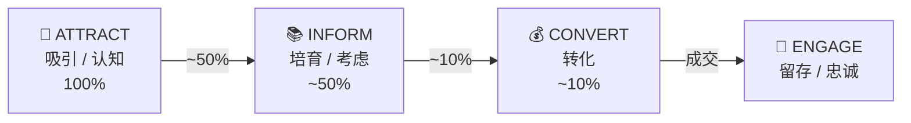
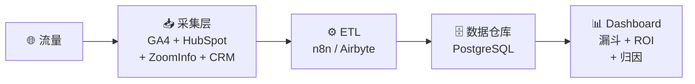

# Supcon Marketing Technology 建议
**数据来源**：Browser 访问验证 + 公开信息检索 + 竞品对标分析

---

## 1. 一句话结论

本报告为 Supcon 海外增长提供**系统架构&数据结构设计以及不同阶段技术选型**，确保在不同发展阶段都有清晰、可迁移、可扩展的决策基础。

核心交付：**获客—转化—培育的自动化基础设施** + **跨阶段演进路径** + **统一数据结构规范**+ **不同阶段技术选型**

---

## 2. 业务背景与数据结构考量

### 2.1 产品线结构（影响数据模型设计）

| 产品线 | 占比 | 具体产品 | 数据结构影响 |
|-------|-----|---------|-------------|
| **Hardware** | ~70% | Control Systems、Valves & Instruments、Robotics、Analyzers | `product_line` 字段需区分 |
| **Software** | ~30% | PA: TPT2 (PA apps)、BA: Tier0, Smart Site, Smart Facility | `product_category` 字段需区分 PA/BA |

### 2.2 核心指标体系（Dashboard 设计依据）

基于 B2B 工业自动化领域的通用实践，建议关注以下指标维度：

| 指标维度 | Primary Metrics | Driver Metrics | 对应看板 |
|---------|----------------|----------------|---------|
| **Awareness** | Share of Voice (SOV)、Aided/Unaided Awareness | Website New Unique Users、Social Media Impressions、Event Leads/Scans/Contacts、PR Mentions、Search Volumes | 流量概览 |
| **Engagement** | Engagement Rate (New/Existing)、Average Time Spent、Monthly Active Accounts | Email Open Rate/CTR、Webinar Attendance Rate、Repeat Attendance Rate、Content Downloads | 培育效果 |
| **Acquisition** | Opportunity Growth Rate、Cost per Qualified Lead (CPQL)、MQL→SQL Conversion Rate | MQL、SQL、Funnel Efficiency (Lead→MQL、Time to MQL) | 销售漏斗 |

---

## 3. 当前官网技术栈与增长侧能力

### 3.1 前端与交付

- **框架**：Next.js（React）
- **CDN**：AWS CloudFront（`d1gnelo9urr3zj.cloudfront.net`）
- **性能监控**：New Relic（`bam.nr-data.net`）

### 3.2 Martech（可直接观测到的部分）

- **Analytics**：GA4（`G-LJMWKMPMRN`）
- **Tag Management**：GTM/gtag 相关加载（页面侧可见）
- **账户识别/数据增强**：ZoomInfo Pixel（`ws.zoominfo.com/pixel/collect`）
- **Marketing Automation**：未在前端直接识别到（不排除“未部署/后端部署/隐藏加载/按区域加载”）

### 3.3 内容资产（用于判断获客与培育的“燃料”）

- **存在内容入口**：Resources（含 Technical Blog）、Press/News、Events
- **更新信号**：2025 年多次更新（Tech Blog 具备持续输出迹象）
- **内容风格**：技术导向，主题集中在 AI/LLM/工业自动化等

---

## 4. MarTech Stack 技术选型建议

### 4.0 技术栈全景与阶段规划

基于竞品对标与 B2B 工业自动化领域通用实践，以下为各能力域的技术选型建议：

| 能力域 | 已确定 | 待选型（本报告建议） | 阶段 | 优先级 |
|-------|-------|-------------------|------|-------|
| **Content Management** | Global Website、MSFT Teams | — | P0 | ✅ 已就绪 |
| **Email Marketing** | — | **HubSpot**（推荐）/ Mailchimp / ListMonk | P0 | 🔴 高 |
| **Marketing Automation** | — | **HubSpot**（推荐）/ Mautic | P0 | 🔴 高 |
| **Lead Management** | BPM/GBPM、Salesforce | HubSpot CRM（与 MA 一体） | P0 | 🔴 高 |
| **CRM** | BPM/GBPM、Salesforce | HubSpot CRM 或对接 Salesforce | P1 | 🟡 中 |
| **Website Analytics** | Google Analytics、LinkedIn Analytics | **Rybbit**（隐私需求时） | P0 | ✅ 已就绪 |
| **Social Media Management** | LinkedIn、YouTube | Ghost?（博客平台） | P1 | 🟡 中 |
| **SEO** | — | Google Search Console（免费） | P0 | 🟢 低 |
| **CRO (Conversion Rate Optimization)** | — | Google Optimize?（已停服）/ **Matomo**（A/B 测试） | P2 | 🟢 低 |
| **Paid Advertising** | — | Google Ads、LinkedIn Ads | P1 | 🟡 中 |
| **Data Integration** | — | **n8n**（推荐）/ 自建 | P1 | 🟡 中 |
| **Live Marketing Dashboard*** | — | **自建**（本报告 Phase 2） | P2 | 🟡 中 |
| **Customer Portal*** | — | 自建 / Salesforce Community | P2 | 🟢 低 |

> **说明**：
> - ✅ 已就绪：当前已部署可用
> - 🔴 高优先级：获客闭环的核心能力
> - 🟡 中优先级：提升转化效率与数据整合
> - 🟢 低优先级：优化提升类，可后续迭代
> - *标注项为需要建设的新能力

### 4.1 技术选型建议（按能力域）

#### Email Marketing + Marketing Automation

| 选项 | 优势 | 劣势 | 建议 |
|-----|------|------|------|
| **HubSpot** | 一体化平台（MA + CRM + Email）、易用、生态完善 | 成本随规模增长 | ✅ **推荐**：P0 阶段首选 |
| Mailchimp | 邮件专精、价格友好 | MA 能力弱、CRM 需另建 | 仅邮件需求时考虑 |
| ListMonk | 开源免费、完全自托管 | 部署周期较长、功能基础 | 成本敏感时考虑 |
| Mautic | 开源、MA 功能完整 | 初始配置成本高、学习曲线 | 需要深度定制时考虑 |

#### Website Analytics

| 选项 | 优势 | 劣势 | 建议 |
|-----|------|------|------|
| **Google Analytics** | 免费、功能全面、已部署 | 数据在 Google 服务器 | ✅ **保留**：继续使用 |
| LinkedIn Analytics | 社媒分析 | 仅限 LinkedIn 数据 | ✅ **已有**：待数据集成 |
| Rybbit | 开源、数据自托管、隐私合规 | 初始部署需 1-2 周 | 🟡 **备选**：有隐私合规需求时 |
| Matomo | 开源、隐私友好、A/B 测试 | 初始部署需 1-2 周 | 🟡 **备选**：需要 CRO 能力时 |

#### Data Integration（连接 MA ↔ CRM/ERP）

| 选项 | 优势 | 劣势 | 建议 |
|-----|------|------|------|
| **n8n** | 开源免费（自托管）、可视化、灵活 | 初始搭建需 1-2 周 | ✅ **推荐**：P1 阶段数据打通 |
| Zapier | 开箱即用、无需部署 | 成本高（按量收费） | 简单场景、预算充足时 |
| 自建 Python | 完全自定义、无平台依赖 | 开发周期较长 | 复杂定制需求时 |

---

## 5. 阶段演进与可迁移性设计

### 5.1 目标形态（面向海外增长的最低可行闭环）

- **统一线索入口**：表单/下载/活动报名 → 进入同一线索库
- **统一跟踪与归因**：关键转化事件、来源、内容触点可被持续追踪
- **基础培育能力**：按主题/行业/角色的邮件序列或内容触达
- **销售协同**：线索分层、路由与回传（至少保证可追踪）

> 具体技术选型见第 4 章。本章聚焦于**阶段演进逻辑**和**可迁移性设计**。

### 5.2 阶段演进触发条件与迁移路径

| 当前阶段 | 触发条件 | 演进方向 | 迁移要点 |
|---------|---------|---------|---------|
| **P0 → P1** | ① 需要与内部 CRM/ERP 双向同步 ② 数据隐私/自托管有明确要求 | 引入 n8n 数据管道 | HubSpot 数据结构不变，增加同步层 |
| **P1 → P2** | ① 线索规模 >10,000/月 ② 多区域/多业务线独立运营 ③ 复杂合规需求（GDPR 多实体） | 升级至 Marketo 或 HubSpot Enterprise | 提前规范字段命名与数据模型，确保迁移无损 |
| **任意阶段 → 数据中台** | ① Phase 1 验证完成 ② 需要跨系统统一视图 ③ 长期成本优化诉求 | 启动自建数据中台 | 核心数据通过 API 抽取，不影响原有系统运行 |

### 5.3 可迁移性设计原则

1. **字段命名规范化**：从 P0 阶段起统一字段命名规则（如 `lead_source`、`industry`、`region`），避免后续迁移时的映射成本
2. **数据模型前置设计**：在 HubSpot 中定义的 Contact Properties 应与未来数据中台的实体模型对齐
3. **API 优先**：所有数据交互通过标准 API 完成，避免硬编码依赖特定平台
4. **事件埋点标准化**：GTM 事件命名遵循统一规范（如 `form_submit_demo`、`content_download_whitepaper`），确保归因数据可跨平台复用

---

## 6. 对标参照

- **可对标（同为相对轻量、可快速闭环）**：Cognite（HubSpot 驱动的一体化营销闭环）
- **升级参照（企业级复杂度）**：Siemens / ABB / Rockwell Automation（双平台与多工具并行的企业级栈）

---

## 7. 风险与需要确认的信息（决策前置）

- **MA 工具“未检测到”不等于“未使用”**：可能存在按区域加载、后端触达、或脚本隐藏/延迟加载等情况。建议以一次“关键转化路径”的抓包复核为准（下载/报名/联系表单）。  
- **CRM/销售流程现状**：是否已有 CRM、线索字段与分配规则、跟进闭环（决定 P1 的必要性与优先级）。  
- **海外重点区域与语言策略**：将直接影响表单、内容、培育与合规配置（Cookie/隐私/邮件）。  

---

## 8. 技术栈费用预估

### 8.1 费用汇总（按阶段）

| 阶段 | 工具组合 | 月度费用（USD） | 年度费用（USD） | 备注 |
|-----|---------|---------------:|---------------:|------|
| **P0 起步** | HubSpot Starter + GA4 + GTM + ZoomInfo（现有） | 50–200 | 600–2,400 | GA4/GTM 免费；ZoomInfo 已在用 |
| **P1 扩展** | HubSpot Professional + n8n（自托管） | 800–1,000 | 9,600–12,000 | n8n 自托管免费，仅服务器成本 |
| **P2 企业级**（可选） | Marketo 或 HubSpot Enterprise | 1,200–3,500 | 14,400–42,000 | 视业务规模再评估 |

### 8.2 各工具明细

| 工具 | 定价模式 | 起步价（USD/月） | 企业级价格（USD/月） | 说明 |
|-----|---------|----------------:|-------------------:|------|
| **HubSpot Starter** | 按功能模块 | 50 | — | 含 Marketing Hub 基础功能 |
| **HubSpot Professional** | 按功能模块 | 800 | — | 含自动化、A/B 测试、高级报告 |
| **HubSpot Enterprise** | 按功能模块 | 3,200 | 3,200+ | 大规模/多业务线场景 |
| **Marketo** | 按数据库规模 | 1,195 | 5,000–15,000 | 企业级 MA，学习曲线较陡 |
| **Google Analytics 4** | 免费 | 0 | 0 | 已在使用 |
| **Google Tag Manager** | 免费 | 0 | 0 | 已在使用 |
| **ZoomInfo** | 按席位/数据量 | 视合同 | 视合同 | 已在使用，增购另计 |
| **n8n（自托管）** | 开源免费 | 0 | 0 | 需自有服务器或云主机 |
| **n8n Cloud** | 按执行次数 | 20 | 50–200 | 无需自托管，按量付费 |

### 8.3 费用说明

- **P0 阶段**：纯 HubSpot Starter，**年度预算约 $600–2,400**。HubSpot 内置流量分析，GA4 可选保留。
- **P1 阶段**：升级至 HubSpot Professional，按需引入 n8n（自托管免费），**年度预算约 $9,600–12,000**。
- **P2 阶段**（可选）：若业务规模显著提升，评估 Marketo 或 HubSpot Enterprise，**年度预算 $14,400–42,000**。

> 以上价格为公开官网定价区间，实际采购可能因席位数、合同周期、折扣等因素浮动。

---

## 9. 转化路径设计与数据流向

### 9.0 营销漏斗模型

**各阶段职责与触点**：

| 阶段 | 目标 | 核心触点 | 关键动作 | 衡量指标 |
|-----|------|---------|---------|---------|
| **Attract / Awareness** | 吸引目标受众 | SEO / SEM / 社媒 / 展会 / 合作伙伴 | Blog、行业报告、品牌曝光 | UV、来源分布、内容阅读 |
| **Inform / Consideration** | 培育兴趣 | Webinar / 白皮书 / Case Study / 邮件序列 | 内容下载、Webinar 参与、邮件互动 | 线索数、MQL、内容转化率 |
| **Convert / Conversion** | 推动成交 | Demo / 报价 / 销售跟进 | Demo 请求、销售会议、方案评估 | SQL、商机数、成交率 |
| **Engage / Loyalty** | 客户留存 | 客户成功 / 培训 / 社区 | 续约、增购、推荐 | 客户数、NPS、复购率 |

---

### 9.1 转化路径（OOTB：纯 HubSpot 闭环）

> **核心逻辑**：Phase 1 验证阶段全部在 HubSpot 内完成，覆盖 Attract → Inform → Convert → Engage 四层漏斗。n8n 仅在需要与内部系统打通时才引入。

---

### 9.2 转化路径（统一数据中台 + 自建 Dashboard）

**核心价值**：一个界面看到：
- 四层漏斗的完整转化路径（Awareness → Consideration → Conversion → Loyalty）
- 每层漏斗的转化率与瓶颈定位
- 跨渠道、跨内容、跨时间的对比分析
- 实时数据 + 历史趋势

**两个版本的对比**：

| 维度 | Phase 1：HubSpot Dashboard | Phase 2：统一数据中台 + 自建 Dashboard |
|-----|---------------------------|--------------------------------------|
| **数据范围** | 仅 HubSpot 内数据 | HubSpot + GA4 + CRM + ERP + 所有内部系统 |
| **可视化能力** | HubSpot 模板报表 | 完全自定义，支持复杂可视化 |
| **资源流转** | 线索维度为主 | 内容 → 流量 → 线索 → 商机 → 成交全链路 |
| **归因分析** | 基础首次/末次归因 | 多触点归因、自定义归因模型 |
| **跨系统关联** | 不支持 | 支持（内部 CRM/ERP 数据打通） |
| **实时性** | 接近实时 | 可配置（实时/T+1） |
| **定位** | 验证闭环、快速上线 | 正式落地、长期运营 |

> **核心逻辑**：Phase 1 用 HubSpot Dashboard 验证指标体系和业务逻辑 → Phase 2 自建 Dashboard 实现"一个界面看到所有营销资源流转与数据表现"。

---

### 9.3 HubSpot 核心配置清单

| 配置项 | 说明 | 优先级 |
|-------|------|-------|
| **追踪代码** | 通过 GTM 部署到网站 | P0 |
| **Contact Properties** | 定义线索字段（公司、行业、地区、来源、意向产品） | P0 |
| **Forms** | 联系表单、Demo 请求表单、内容下载表单 | P0 |
| **Email Templates** | 确认邮件、欢迎邮件、培育序列 | P0 |
| **Workflows** | 自动化流程（表单 → 邮件 → 评分 → 分配） | P1 |
| **Lead Scoring** | 行为评分 + 属性评分 | P1 |
| **Dashboard** | 线索漏斗、转化率、来源分析 | P1 |

---

### 9.4 核心数据结构定义（跨阶段复用）

以下数据结构在 P0/P1/P2 及数据中台阶段保持一致，确保演进过程中数据可迁移、口径统一。

#### 9.4.1 线索实体（Lead/Contact）

| 字段 | 说明 | 数据类型 | 来源 |
|-----|------|---------|------|
| `lead_id` | 唯一标识 | String | 系统生成 |
| `email` | 邮箱（主键） | String | 表单 |
| `company` | 公司名称 | String | 表单 / ZoomInfo 补全 |
| `industry` | 行业（标准化枚举） | Enum | 表单 / 手动分类 |
| `region` | 地区（国家/区域） | Enum | IP / 表单 |
| `product_line` | 产品线（Hardware/Software） | Enum | 表单 / 内容关联 |
| `product_category` | 产品类别 | Enum | 表单 / 内容关联 |
| `lead_source` | 首次来源渠道 | Enum | UTM / Referrer |
| `lead_source_detail` | 来源明细（广告系列/内容） | String | UTM |
| `lifecycle_stage` | 生命周期阶段 | Enum | 系统规则 |
| `lead_score` | 线索评分 | Integer | 行为 + 属性计算 |
| `lead_value` | 线索预估价值（USD） | Decimal | 规则计算 |
| `created_at` | 创建时间 | Timestamp | 系统 |
| `last_activity_at` | 最后活动时间 | Timestamp | 系统 |

**产品线字段（`product_line` & `product_category`）标准定义**：

| product_line | product_category | 具体产品 | 占比 |
|-------------|-----------------|---------|-----|
| `hardware` | `control_systems` | Control Systems | ~70% |
| `hardware` | `valves_instruments` | Valves & Instruments | |
| `hardware` | `robotics` | Robotics | |
| `hardware` | `analyzers` | Analyzers | |
| `software` | `pa` | TPT2 (PA apps) | ~30% |
| `software` | `ba` | Tier0, Smart Site, Smart Facility | |

**生命周期阶段（`lifecycle_stage`）标准定义**（与漏斗模型对齐）：

| 漏斗层级 | 阶段 | 定义 | 触发条件 | 转化率基准 |
|---------|-----|------|---------|-----------|
| **Awareness** | `visitor` | 匿名访客 | 访问网站 | 100% |
| **Awareness** | `subscriber` | 订阅者 | Newsletter 订阅 | — |
| **Consideration** | `lead` | 线索 | 任意表单提交（内容下载/Webinar） | ~50% |
| **Consideration** | `mql` | 营销合格线索 | 评分达到阈值 / 高意向行为 | — |
| **Conversion** | `sql` | 销售合格线索 | 销售确认跟进 | ~10% |
| **Conversion** | `opportunity` | 商机 | 进入销售管道 | — |
| **Loyalty** | `customer` | 客户 | 成交 | — |
| **Loyalty** | `evangelist` | 推荐者 | NPS 高分 / 主动推荐 | — |

#### 9.4.2 归因维度（Attribution）

| 维度 | 说明 | 标准值示例 |
|-----|------|-----------|
| `utm_source` | 流量来源 | google / linkedin / direct |
| `utm_medium` | 媒介类型 | cpc / organic / email / referral |
| `utm_campaign` | 广告系列 | webinar_2025q1 / whitepaper_ai |
| `utm_content` | 内容标识 | blog_llm_agents / case_study_sinopec |
| `first_touch_source` | 首次触点来源 | 同上 |
| `last_touch_source` | 末次触点来源 | 同上 |
| `conversion_event` | 转化事件 | form_submit_demo / content_download |

#### 9.4.3 事件埋点规范（GTM 标准）

| 事件名 | 触发场景 | 关键参数 |
|-------|---------|---------|
| `page_view` | 页面浏览 | page_path, page_title |
| `form_submit_contact` | 联系表单提交 | form_id, form_name |
| `form_submit_demo` | Demo 请求提交 | form_id, product |
| `content_download` | 内容下载 | content_type, content_title |
| `webinar_register` | Webinar 注册 | webinar_id, webinar_title |
| `video_play` | 视频播放 | video_id, video_title, percent |

> **设计原则**：以上数据结构从 P0 阶段在 HubSpot 中定义，后续迁移至数据中台时保持字段名和枚举值一致，确保历史数据可无损迁移、跨阶段口径统一。

---

### 9.5 数据看板方案（HubSpot 验证 + 统一数据中台落地）

| 阶段 | 方案 | 定位 | 周期 |
|-----|------|------|------|
| **Phase 0** | 需求设计 | 明确范围与规格 | 2-4 周 |
| **Phase 1** | HubSpot Dashboard | 验证闭环 | 4-6 周 |
| **Phase 2** | 统一营销数据中台 | 正式落地 | 12-16 周 |

---

#### Phase 0：需求设计

**目标**：明确项目范围、指标体系、数据口径，输出需求规格

| 任务 | 说明 | 交付物 |
|-----|------|--------|
| **业务需求梳理** | 与业务方对齐核心指标、看板需求、使用场景 | 业务需求文档 |
| **数据现状调研** | 盘点现有数据源、字段、口径、质量 | 数据现状报告 |
| **指标体系设计** | 定义核心指标、计算逻辑、维度拆分 | 《营销数据指标体系 v1.0》 |
| **技术方案设计** | 评估技术选型、架构设计、资源需求 | 技术方案文档 |

---

#### Phase 1：HubSpot Dashboard（验证闭环）

**目标**：快速验证获客→转化→培育的完整链路，跑通数据流

| 任务 | 说明 | 交付物 |
|-----|------|--------|
| **HubSpot 配置** | 追踪代码、表单、线索字段、工作流 | 配置完成 |
| **Dashboard 搭建** | 按漏斗层级搭建看板 | HubSpot Dashboard |
| **数据验证** | 验证数据采集、口径、业务逻辑是否正确 | 验证报告 |
| **需求规格输出** | 基于验证结果，输出数据中台需求规格 | 《数据中台需求规格说明书》 |

---

#### Phase 2：统一营销数据中台（正式方案）

**项目定位**：整合营销全链路数据，构建统一数据基础设施（架构设计见 9.2 节）

**核心模块与交付物**：

| 模块 | 说明 | 交付物 | 预估周期 |
|-----|------|--------|---------|
| **数据集成** | 对接 HubSpot / GA4 / CRM / ERP 等多数据源 | 数据管道 + ETL 脚本 | 3-4 周 |
| **数据建模** | 统一数据模型、指标定义、维度设计 | 数据字典 + ER 图 | 2-3 周 |
| **数据仓库** | 存储清洗后的结构化数据 | 数据库 + 表结构 | 2-3 周 |
| **API 服务** | 提供标准化数据查询接口 | API 文档 + 接口服务 | 2-3 周 |
| **可视化看板** | 营销全链路数据可视化 | Dashboard 界面 | 3-4 周 |
| **权限管理** | 多角色、多层级数据权限 | 权限配置 + 审计日志 | 1-2 周 |

> **执行路径**：Phase 0 需求设计 → Phase 1 HubSpot 验证闭环 → Phase 2 数据中台分模块交付。
>
> **说明**：具体技术选型需在 Phase 1 验证完成后，结合 IT 架构规范与资源评估，由相关技术团队共同确定。以上周期为预估，实际需根据资源投入和优先级调整。

---

## 10. 证据引用与对标依据（可追溯）

### 10.1 本报告的建议基于两类证据

1. **Supcon官网的Browser验证**（当前技术栈与内容入口）：
   - Next.js / CloudFront / GA4 / ZoomInfo Pixel / New Relic（见第3章）
   - “未检测到MA”作为“待复核项”处理（见第6章）

2. **18家竞品的“实际技术栈 + 自动化逻辑链条”对标样本**：
   - 技术栈来源：BuiltWith技术栈汇总 + Browser工具直接验证（网络请求/Cookie/脚本）
   - 逻辑链条来源：对竞品“访客追踪 → 线索识别 → 转化入口 → 培育/销售协同”的共性结构抽象

### 10.2 关键对标结论（用于解释为何推荐"轻量可扩展栈"）

- **Marketing Automation是主干能力**：竞品中 Marketo / Eloqua / Adobe MC 等企业级MA普遍出现，用于承接线索库、表单、门控内容与培育自动化。
- **Tag + Analytics是标配**：GTM/GA4 在竞品中覆盖面高，通常与MA并行，分别承担“数据采集/归因”和“线索运营/自动化”的职责分工。
- **账户识别/数据增强常见**：ZoomInfo 等工具在竞品中用于B2B账户识别、表单补全与线索质量提升。
- **工作流自动化属于“后端集成层”**：n8n/Zapier/Make 等多用于连接 MA ↔ CRM/数据源，前端检测工具通常无法直接识别，因此建议在“需要系统打通”时再引入（对应本报告P1）。

### 10.3 可直接引用的证据文件（本地路径）

- 18家竞品综合报告（英文）：`companyAnalysis/Martech_Automation_and_Technology_Stack_Analysis.md`
- 18家竞品综合报告（中文，含更多细节）：`companyAnalysis/Martech_自动化运营机制与技术栈分析.md`
- BuiltWith技术栈汇总表：`Website Technology Profile Data/builtwith_technology_profiles.csv`

